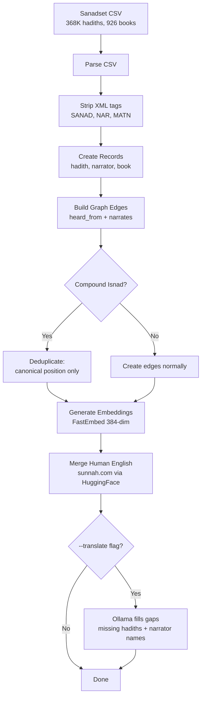
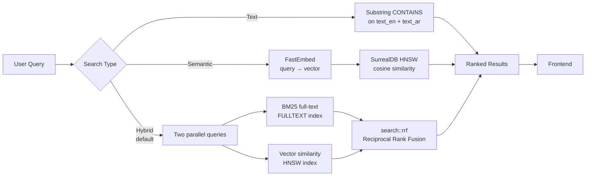
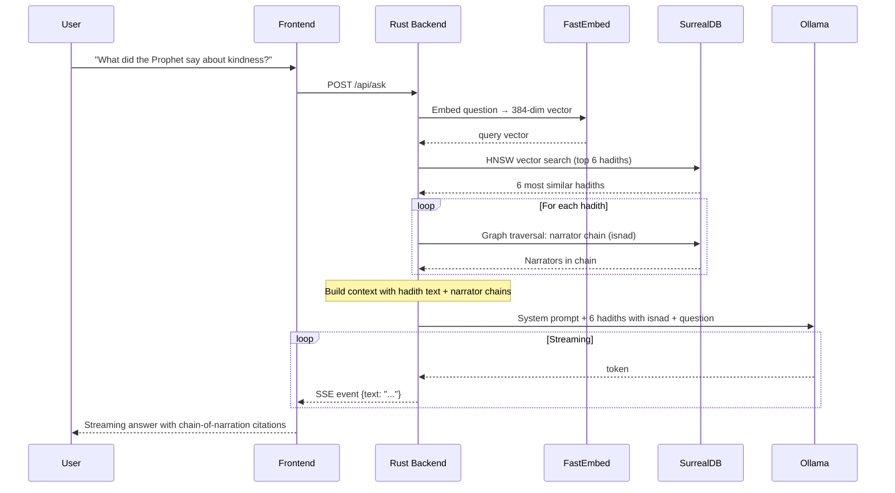
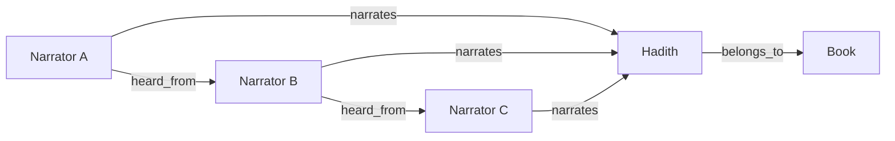

# Hadith Explorer

Browse, search, and explore Islamic hadith collections with narrator chain (isnad) visualization, hybrid BM25+vector search, and GraphRAG-powered Q&A — all running locally on SurrealDB.

## Architecture Overview

```
┌──────────────────────────────────────────────────────────────┐
│                      SvelteKit Frontend                      │
│  Dashboard │ Hadiths │ Narrators │ Search │ Ask (GraphRAG)   │
└────────────────────────────┬─────────────────────────────────┘
                             │ JSON API
┌────────────────────────────┴─────────────────────────────────┐
│                     Rust / Axum Backend                       │
│                                                              │
│  ┌──────────┐  ┌─────────────┐  ┌───────────┐ ┌───────────┐ │
│  │ Handlers │  │   Search    │  │ GraphRAG  │ │  Ingest   │ │
│  │ (JSON)   │  │ Hybrid/BM25 │  │  Ollama   │ │ Sanadset  │ │
│  │          │  │  + Vector   │  │  + Isnad  │ │           │ │
│  └────┬─────┘  └─────┬───────┘  └─────┬─────┘ └─────┬─────┘ │
│       │              │                │              │       │
│  ┌────┴──────────────┴────────────────┴──────────────┴────┐  │
│  │                SurrealDB (SurrealKV)                    │  │
│  │  hadiths │ narrators │ books │ heard_from │ narrates    │  │
│  │  HNSW vector index │ BM25 full-text │ graph edges      │  │
│  │  FastEmbed 384-dim embeddings stored per hadith        │  │
│  └────────────────────────────────────────────────────────┘  │
│                                                              │
│  ┌──────────────┐  ┌──────────────┐                          │
│  │  FastEmbed   │  │   Ollama     │                          │
│  │ (embeddings) │  │ (local LLM)  │                          │
│  └──────────────┘  └──────────────┘                          │
└──────────────────────────────────────────────────────────────┘
```

### Ingest Pipeline



### Search Flow



### Ask (GraphRAG) Flow



### Database Graph Model



## Setup

### Prerequisites

- [Rust](https://rustup.rs/) (latest stable)
- [Node.js](https://nodejs.org/) (v20+)
- [Ollama](https://ollama.ai/) (for fallback translation and Ask feature)

### Install Ollama

```bash
brew install ollama        # macOS
ollama pull qwen3:8b       # recommended for translation + Ask
ollama serve               # start the Ollama server
```

### Build

```bash
make build
# or manually:
cd frontend && npm install && npm run build && cd ..
cargo build
```

## Data Sources

### Sanadset 650K (Arabic text + narrator chains)

The [Sanadset 650K dataset](https://data.mendeley.com/datasets/5xth87zwb5/4) provides 368K+ hadiths from 926 Arabic hadith books with pre-parsed narrator chains (isnad).

**CSV columns used:**

| Column | Content | How we use it |
|---|---|---|
| `Hadith` | Full Arabic text with `<SANAD>`, `<NAR>`, `<MATN>` tags | Stored as `text_ar` (tags stripped) |
| `Book` | Arabic book name | Stored as `book_name`, used for grouping |
| `Num_hadith` | Hadith number (global, not per-book) | Stored as `hadith_number` |
| `Matn` | Just the hadith content (no isnad) | Stored as `matn`, used for Ollama translation |
| `Sanad` | Pre-parsed narrator chain as Python list | Used to create narrator records + chain edges |
| `Sanad_Length` | Number of narrators | Validation |

**Auto-downloaded** during first ingest if `data/sanadset.csv` is not present. The zip (~150MB) is downloaded from Mendeley Data and the largest CSV is extracted automatically.

Manual download: visit https://data.mendeley.com/datasets/5xth87zwb5/4

### Sunnah.com English Translations (human-quality)

For the 6 major hadith collections (Kutub al-Sittah), human English translations are automatically downloaded from [HuggingFace](https://huggingface.co/datasets/meeAtif/hadith_datasets) during ingest:

| Book | Arabic Name | Hadiths |
|---|---|---|
| Sahih al-Bukhari | صحيح البخاري | ~7,000 |
| Sahih Muslim | صحيح مسلم | ~5,000 |
| Sunan Abi Dawud | سنن أبي داود | ~4,300 |
| Sunan an-Nasa'i | سنن النسائى الصغرى | ~5,500 |
| Jami at-Tirmidhi | سنن الترمذي | ~3,900 |
| Sunan Ibn Majah | سنن ابن ماجه | ~4,300 |

Translations are matched by **Arabic text similarity** (not hadith number, since Sanadset and sunnah.com use different numbering systems). Cached in `data/translations/`.

## Ingest

```bash
# List all 926 available books
cargo run -- ingest --list-books

# Ingest the 6 major books (default) with human English translations
cargo run -- ingest --limit 10           # quick test: 10 hadiths per book
cargo run -- ingest                      # full: all hadiths from 6 major books

# With Ollama fallback for any missing translations
cargo run -- ingest --translate          # human English + Ollama fills gaps
cargo run -- ingest --translate --translate-model qwen3:8b

# Ingest specific books by number (from --list-books output)
cargo run -- ingest --books 1,8,13

# Ingest all 926 books
cargo run -- ingest --all --translate

# Fresh start
rm -rf db_data && cargo run -- ingest --translate
```

### How translation works

The ingest pipeline has a two-tier translation system:

**Tier 1 — Human translations (always runs):**
1. Downloads sunnah.com English CSVs from HuggingFace for the 6 major books
2. Matches each Sanadset hadith to a sunnah.com translation by **Arabic text similarity** — the matn (hadith content) is normalized (diacritics stripped, alef variants unified) and matched against the sunnah.com Arabic text. This is necessary because Sanadset uses global hadith numbering while sunnah.com uses per-book numbering. Achieves ~93% match rate on Bukhari.
3. Extracts English narrator names from "Narrated X:" prefixes

**Tier 2 — Ollama fallback (with `--translate` flag):**
1. Scans all hadiths where `text_en` is still missing (other books, or gaps in sunnah.com data)
2. Translates the `matn` (hadith content only, not the isnad preamble) via Ollama
3. Transliterates narrator names that don't have English yet (batched 20 at a time for speed)

### Compound isnad handling

Some hadiths have multiple parallel chains of narration (compound isnads), indicated by `ح` (haa' al-tahweel) in the Arabic text. The Sanadset dataset flattens these into a single list, which can create incorrect narrator relationships.

Our solution: when creating `heard_from` edges, we only create an edge between consecutive narrators if **both are at their last (canonical) position** in the chain. A narrator's last occurrence represents their true position in the transmission hierarchy. We also use diacritics-stripped comparison (`slug_bare()`) for duplicate detection, since the same narrator may appear with different tashkeel.

## Run

```bash
cargo run -- serve --port 3000

# Or use Make
make dev     # build + start in background
make stop    # stop background server
```

Open http://localhost:3000

### Server options

```bash
cargo run -- serve --port 3000 \
  --ollama-url http://localhost:11434 \
  --ollama-model qwen3:8b
```

## Features

### Browse
- Dashboard with stats (hadith/narrator/book counts) and book grid
- Hadith list with pagination, filterable by book
- Narrator list with hadith counts, searchable
- Book listing

### Hadith Detail
- Arabic text with matn (hadith content) highlighted in quotes
- English translation (human or Ollama) in green serif blockquote
- Narrator chips (clickable, navigate to narrator detail)
- Narrator chain — clean card-based vertical visualization showing the isnad from Prophet/Companion down to the compiler

### Narrator Detail
- Bilingual name (Arabic + English)
- Three tabs: **Network** (Cytoscape.js graph of teachers/students), **Hadiths** (all hadiths narrated), **Connections** (teacher/student chips)
- Deduplication of hadiths (handles multiple narrates edges from compound isnads)

### Search

The search system supports three modes. Understanding how each works helps you choose the right one for your query.

#### Hybrid Search (default)

Hybrid search is the default and recommended mode. It combines two fundamentally different search techniques into one query, giving you the best of both worlds.

**How it works:** When you search for "fasting in Ramadan", two separate searches run in parallel:

1. **BM25 keyword scoring** — SurrealDB's full-text search index looks for the literal words "fasting" and "Ramadan" in the hadith text. BM25 (Best Matching 25) is a ranking algorithm that scores documents based on how often your search terms appear, weighted by how rare those terms are across the entire collection. A hadith that mentions "Ramadan" scores higher if "Ramadan" is a relatively uncommon word, because it's more likely to be specifically about Ramadan rather than just mentioning it in passing. BM25 also accounts for document length — a short hadith that mentions "fasting" is likely more focused on the topic than a long hadith that mentions it once among many subjects.

2. **Vector similarity scoring** — FastEmbed converts your query into a 384-dimensional vector (a list of 384 numbers that represent the *meaning* of your text). This vector is compared against pre-computed vectors for every hadith using cosine similarity via SurrealDB's HNSW index. This finds hadiths that are *semantically* related even if they use different words. For example, a search for "fasting in Ramadan" would also find hadiths about "abstaining from food during the holy month" because the meaning is similar.

3. **Reciprocal Rank Fusion (RRF)** — The two result sets are run as separate queries, then fused using SurrealDB's built-in `search::rrf()` function with k=60. RRF works by converting each result's rank position into a score (1/(k+rank)), then summing the scores across both lists. A hadith that ranks highly in *both* keyword and semantic results gets a strong combined score. A hadith that only appears in one list still gets included but with a lower score. This means you get precise keyword matches *and* meaning-based results, ranked by overall relevance.

**When to use it:** For most searches. It handles both specific keyword lookups ("Abu Huraira prayer") and conceptual questions ("what Islam says about treating neighbors") in one query.

#### Text Search

Substring matching on `text_en` (case-insensitive) and `text_ar` fields using SurrealQL's `CONTAINS` operator. Simple and fast — finds hadiths where your exact search terms appear in the text.

**When to use it:** When you know the exact words or phrases you're looking for, or when searching for specific Arabic terms.

#### Semantic Search

Pure vector similarity search. Your query is embedded into a 384-dimensional vector by FastEmbed (using the multilingual-e5-small model), then compared against all hadith embeddings using cosine similarity via SurrealDB's HNSW (Hierarchical Navigable Small World) index.

**What HNSW is:** HNSW is a graph-based algorithm for approximate nearest neighbor search. Instead of comparing your query vector against every single hadith vector (which would be slow), HNSW builds a multi-layer graph where similar vectors are connected. At query time, it navigates this graph from a random entry point, greedily hopping to more similar vectors at each step. This finds the top matches in logarithmic time rather than linear time — critical when searching across hundreds of thousands of hadiths.

**When to use it:** For conceptual or meaning-based searches where you don't know the exact terminology, or for cross-language queries (searching in English to find Arabic hadiths about the same topic).

### Ask (GraphRAG)

The Ask feature is a chat interface where you can ask questions about hadiths in natural language. It uses **GraphRAG** — a combination of Retrieval-Augmented Generation (RAG) and knowledge graph traversal.

#### What is RAG?

RAG (Retrieval-Augmented Generation) solves a fundamental problem with Large Language Models (LLMs): they can generate fluent text, but they hallucinate facts. An LLM asked about hadiths might confidently cite a hadith that doesn't exist.

RAG fixes this by adding a retrieval step before generation:
1. **Retrieve** relevant documents from a database based on the user's question
2. **Augment** the LLM's prompt with these documents as context
3. **Generate** an answer that is grounded in the retrieved documents

This way, the LLM can only reference hadiths that actually exist in the database. The system prompt explicitly instructs it to use *only* the provided context and to say honestly if the context is insufficient.

#### What is GraphRAG?

Standard RAG retrieves documents as isolated text chunks. But hadiths aren't isolated — they exist within a rich network of relationships. Every hadith has an **isnad** (chain of narration): a sequence of scholars who transmitted the hadith from the Prophet Muhammad (peace be upon him) down through generations.

GraphRAG enhances standard RAG by traversing the knowledge graph to include this relational context. After retrieving the 6 most relevant hadiths via vector search, the system performs a **graph traversal** on each hadith to fetch its narrator chain:

```
SurrealDB query: SELECT <-narrates<-narrator.{name_en} FROM hadith:xyz
```

This walks the graph edges backwards from the hadith to find all narrators in its chain of transmission.

The resulting context sent to the LLM looks like this:

```
Hadith #5027 — Narrated Abu Huraira
Chain of narration: Abu Huraira → Abdul Razzaq → Ma'mar → Hammam
The Prophet (peace be upon him) said: "None of you truly believes
until he loves for his brother what he loves for himself."
```

This enables the LLM to give richer, more scholarly answers that cite not just the hadith text but also its chain of transmission — which is central to hadith authentication in Islamic scholarship.

#### How it works end-to-end

1. Your question ("What did the Prophet say about kindness to animals?") is sent to `POST /api/ask`
2. **Embedding**: FastEmbed converts your question into a 384-dimensional vector
3. **Retrieval**: SurrealDB's HNSW index finds the 6 hadiths most semantically similar to your question
4. **Graph traversal**: For each retrieved hadith, SurrealDB traverses the `narrates` and `heard_from` graph edges to reconstruct the narrator chain (isnad)
5. **Context assembly**: The hadith text, narrator attribution, and chain of narration are combined into a structured context block
6. **Generation**: The context + your question are sent to Ollama (local LLM). The system prompt instructs the LLM to act as an Islamic scholar, cite hadith numbers, mention chains of narration when relevant, and only use the provided context
7. **Streaming**: The response streams back token-by-token via Server-Sent Events (SSE), so you see the answer appear progressively in the UI
8. **Sources**: The retrieved hadiths are shown as collapsible cards below the answer, so you can verify the LLM's citations
9. **Suggestion chips**: Common questions are shown as clickable chips for quick access

## Makefile Commands

```bash
make build        # build backend + frontend
make dev          # build + start server in background
make stop         # stop background server
make server       # build + start server in foreground
make ingest       # full ingest (Arabic + human English)
make ingest-test  # quick test: 5 per book + Ollama translation
make ingest-full  # full 6 books + Ollama translation
make list-books   # show all 926 available books
make clean        # wipe all generated data
```

## Project Structure

```
hadith/
├── Cargo.toml                    # Rust dependencies
├── Makefile                      # Build/run shortcuts
├── README.md
├── data/
│   ├── sanadset.csv              # Sanadset 650K (auto-downloaded)
│   └── translations/             # Cached sunnah.com English CSVs
├── db_data/                      # SurrealDB data (generated)
├── src/
│   ├── main.rs                   # CLI: Ingest + Serve commands
│   ├── db.rs                     # SurrealDB connection + schema
│   ├── models.rs                 # Data types (Hadith, Narrator, Book, API responses)
│   ├── embed.rs                  # FastEmbed vector generation
│   ├── search.rs                 # Hybrid (BM25+vector), text, and semantic search
│   ├── rag.rs                    # GraphRAG: vector retrieval + graph traversal + Ollama
│   ├── ingest/
│   │   ├── mod.rs
│   │   └── sanadset.rs           # Sanadset CSV parsing, chain building, translation
│   └── web/
│       ├── mod.rs                # Axum router + SPA serving
│       └── handlers.rs           # All API endpoints
└── frontend/
    ├── svelte.config.js          # SvelteKit SPA config (adapter-static)
    ├── vite.config.ts            # Vite dev proxy
    ├── src/
    │   ├── app.css               # Global styles (light theme, Noto Naskh Arabic)
    │   ├── routes/
    │   │   ├── +layout.svelte    # Sidebar + TopBar shell
    │   │   ├── +page.svelte      # Dashboard
    │   │   ├── hadiths/
    │   │   │   ├── +page.svelte  # Hadith list
    │   │   │   └── [id]/+page.svelte  # Hadith detail
    │   │   ├── narrators/
    │   │   │   ├── +page.svelte  # Narrator list
    │   │   │   └── [id]/+page.svelte  # Narrator detail
    │   │   ├── books/+page.svelte
    │   │   ├── search/+page.svelte
    │   │   └── ask/+page.svelte  # RAG chat
    │   └── lib/
    │       ├── api.ts            # Typed API client
    │       ├── types.ts          # TypeScript interfaces
    │       ├── utils.ts          # Helpers (truncate, stripHtml)
    │       └── components/
    │           ├── layout/       # Sidebar, TopBar
    │           ├── common/       # Badge, Pagination, LoadingSpinner
    │           ├── hadith/       # HadithCard
    │           ├── narrator/     # NarratorCard, NarratorChip
    │           └── graph/        # ChainView (cards), GraphView (Cytoscape)
    └── build/                    # Production build (generated)
```

## API Endpoints

| Method | Endpoint | Description |
|---|---|---|
| GET | `/api/stats` | Hadith/narrator/book counts |
| GET | `/api/books` | All books |
| GET | `/api/hadiths?book=&page=&limit=` | Paginated hadith list |
| GET | `/api/hadiths/{id}` | Hadith detail + narrators |
| GET | `/api/narrators?q=&page=&limit=` | Paginated narrator list |
| GET | `/api/narrators/{id}` | Narrator + hadiths + teachers + students |
| GET | `/api/search?q=&type=hybrid\|text\|semantic` | Bilingual search (hybrid is default) |
| GET | `/api/chain/{hadith_id}` | Narrator chain graph data |
| GET | `/api/narrators/{id}/graph` | Narrator network graph data |
| POST | `/api/ask` | RAG Q&A (SSE streaming) |
| POST | `/api/internal/translate` | Update translations (internal) |

## Database Schema

SurrealDB with SurrealKV backend. Graph-capable document store.

**Tables:**
- `hadith` — hadith_number, book_id, text_ar, text_en, matn, narrator_text, book_name, embedding (384-dim float vector)
- `narrator` — name_ar, name_en, search_name, gender, generation, bio, kunya, aliases, birth_year, death_year, locations, tags, reliability_rating, reliability_prior, reliability_source
- `book` — book_number, name_en, name_ar

**Relations (graph edges):**
- `heard_from` — narrator → narrator (isnad chain: student heard from teacher)
- `narrates` — narrator → hadith (who narrated which hadith)
- `belongs_to` — hadith → book

**Indexes:**
- HNSW vector index on `hadith.embedding` for semantic/hybrid search (384 dimensions, cosine distance)
- BM25 full-text index on `hadith.text_en` (`FULLTEXT ANALYZER en_analyzer BM25 HIGHLIGHTS` — English with snowball stemming)
- BM25 full-text index on `hadith.text_ar` (`FULLTEXT ANALYZER ar_analyzer BM25 HIGHLIGHTS` — Arabic tokenizer)

## Tech Stack

| Layer | Technology | Purpose |
|---|---|---|
| Backend | Rust, Axum | HTTP server, JSON API |
| Database | SurrealDB (SurrealKV) | Document store + graph edges + HNSW vector index + BM25 full-text |
| Embeddings | FastEmbed (multilingual-e5-small) | 384-dim vectors for semantic/hybrid search |
| Frontend | SvelteKit 2, Svelte 5 | SPA served as static files |
| Graph viz | Cytoscape.js | Narrator network visualization |
| LLM | Ollama (local) | Translation fallback + RAG Q&A |
| Data | Sanadset 650K | Arabic hadith text + narrator chains |
| Translations | sunnah.com / HuggingFace | Human English for 6 major books |

## Contributing

### Development setup

```bash
git clone <repo>
cd hadith
make build

# Quick test data
cargo run -- ingest --limit 5 --translate

# Start dev
make dev
# Frontend dev server with hot reload:
cd frontend && npm run dev
```

### Key areas for contribution

- **More hadith books with English translations** — currently only 6 major books have human translations
- **Arabic NLP** — better compound isnad parsing, narrator name disambiguation, improved Arabic BM25 analyzer with morphological stemming
- **UI/UX** — improved chain visualization, mobile responsive, accessibility
- **Search** — search result highlighting, faceted search by book/narrator/grade
- **Narrator metadata** — generation (tabaqat), reliability grading, biographical data
- **Performance** — batch DB operations during ingest, pagination optimization
