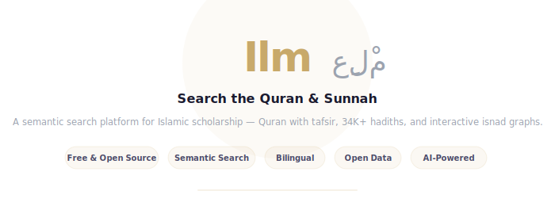
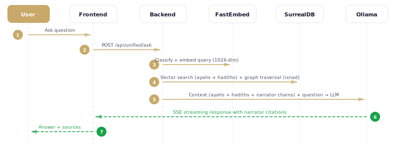
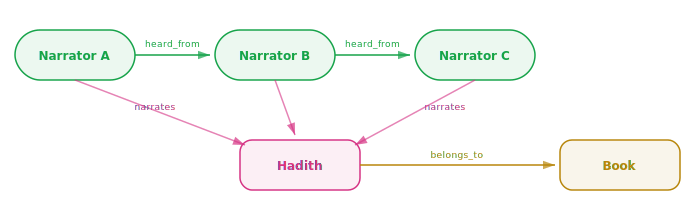

<p align="center">
  
</p>

<p align="center">
  <strong>Search the Quran & Sunnah. <em>Deeply.</em></strong><br>
  A semantic search platform for Islamic scholarship — Quran with tafsir, 368K+ hadiths with narrator chains, and interactive isnad graphs.
</p>

---

> **[Methodology & Algorithms](docs/METHODOLOGY.md)** — CL/PCL transmission analysis &nbsp;|&nbsp; **[Data Sources](docs/DATA_SOURCES.md)** — Dataset documentation
>
> See also Barmaver's [*Dismantling Orientalist Narratives*](https://www.academia.edu/143038577/Dismantling_Orientalist_Narratives_A_Critique_of_Orientalists_Approach_to_Hadith_with_special_focus_on_Juynboll) (2025, free on Academia.edu).

## Architecture

<p align="center">
  
</p>

Rust backend serving a SvelteKit SPA, with SurrealDB as a unified graph + vector + full-text database. Embeddings via FastEmbed, LLM via local Ollama.

## Features

- **Quran Reader** — 114 surahs with Tajweed Arabic, Sahih International translation, expandable Tafsir Ibn Kathir per ayah
- **Hadith Explorer** — 368K+ hadiths from 926 books across the 6 canonical collections
- **Narrator Networks** — 18K+ narrators with interactive Cytoscape.js graph visualization, Ibn Hajar reliability grades
- **Hybrid Search** — BM25 full-text + 384-dim semantic vectors fused with Reciprocal Rank Fusion
- **Ask AI (GraphRAG)** — Natural language Q&A grounded in Quran/Hadith via local Ollama, with isnad-aware context
- **Transmission Analysis** — Hadith family clustering, Common Link / Partial Common Link analysis, word-level matn diffing

## Quick Start

### Prerequisites

- [Rust](https://rustup.rs/) (latest stable)
- [Node.js](https://nodejs.org/) (v20+)
- [Ollama](https://ollama.ai/) — `ollama pull qwen3:8b && ollama serve`

### Build & Run

```bash
make build                    # build backend + frontend
make ingest                   # ingest 6 major books (auto-downloads data)
make analyze                  # enrich narrators + cluster families
make quran                    # download + ingest Quran + tafsir
make dev                      # start server at localhost:3000
```

> **Note:** SurrealDB's HNSW vector index requires extra stack space. When running `cargo run` directly (outside of `make`), set `RUST_MIN_STACK=8388608`. The Makefile handles this automatically.

## Data Sources

| Dataset | Records | Content |
|---|---|---|
| [Sanadset 650K](https://data.mendeley.com/datasets/5xth87zwb5/4) | 368K hadiths | Arabic text + pre-parsed narrator chains from 926 books |
| [Sunnah.com](https://huggingface.co/datasets/meeAtif/hadith_datasets) | 33K translations | Human English for 6 canonical collections |
| [Tanzil.net](https://tanzil.net/) | 6,236 ayahs | Uthmani Arabic + Sahih International English |
| [Tafsir Ibn Kathir](https://huggingface.co/datasets/M-AI-C/en-tafsir-ibn-kathir) | 114 surahs | Classical exegesis in English |
| [AR-Sanad](https://github.com/somaia02/Narrator-Disambiguation) | 18K narrators | Ibn Hajar reliability classifications (Taqrib al-Tahdhib) |

All datasets are auto-downloaded on first run. See [DATA_SOURCES.md](docs/DATA_SOURCES.md) for details.

## Ingest Pipeline

<p align="center">
  
</p>

Parses the Sanadset CSV, builds the narrator graph, generates embeddings, and merges human English translations from sunnah.com. Use `--translate` to fill gaps with Ollama.

## Search

<p align="center">
  
</p>

Three modes: **Hybrid** (default — BM25 + vector via Reciprocal Rank Fusion), **Text** (substring match), and **Semantic** (pure vector similarity). Works across both Arabic and English text.

## Ask (GraphRAG)

<p align="center">
  
</p>

Ask questions in natural language. The system retrieves the 6 most relevant hadiths via vector search, traverses the narrator graph to reconstruct each isnad (chain of narration), then streams an answer from a local LLM grounded in the retrieved context. Responses include narrator chain citations.

## Graph Model

<p align="center">
  
</p>

SurrealDB stores narrators, hadiths, and books as documents connected by `heard_from`, `narrates`, and `belongs_to` graph edges — enabling isnad reconstruction and network analysis.

## Training Pipeline

<p align="center">
  
</p>

Fine-tune a domain-specific LLM on hadith and Quran data, then deploy it through the existing Ollama-based ask loop with zero backend changes. The pipeline generates ~1,400 ChatML Q&A pairs matching the exact RAG prompt pattern from `rag.rs`, fine-tunes via LoRA (MLX locally or Unsloth on Colab), and exports to GGUF for Ollama. See [TRAINING.md](docs/TRAINING.md) for the full guide.

## Tech Stack

| Layer | Technology | Purpose |
|---|---|---|
| Backend | Rust, Axum | HTTP server, JSON API |
| Database | SurrealDB (SurrealKV) | Graph + HNSW vectors + BM25 full-text |
| Embeddings | FastEmbed (multilingual-e5-small) | 384-dim semantic vectors |
| Frontend | SvelteKit 2, Svelte 5 | SPA served as static files |
| Graph Viz | Cytoscape.js | Narrator network visualization |
| LLM | Ollama (local) | Translation fallback + RAG Q&A |

## Contributing

```bash
git clone <repo> && cd hadith
make build
cargo run -- ingest --limit 5 --translate   # quick test data
cd frontend && npm run dev                   # hot reload at :5173
```

See [METHODOLOGY.md](docs/METHODOLOGY.md) for the scholarly framework and [DATA_SOURCES.md](docs/DATA_SOURCES.md) for dataset documentation.
