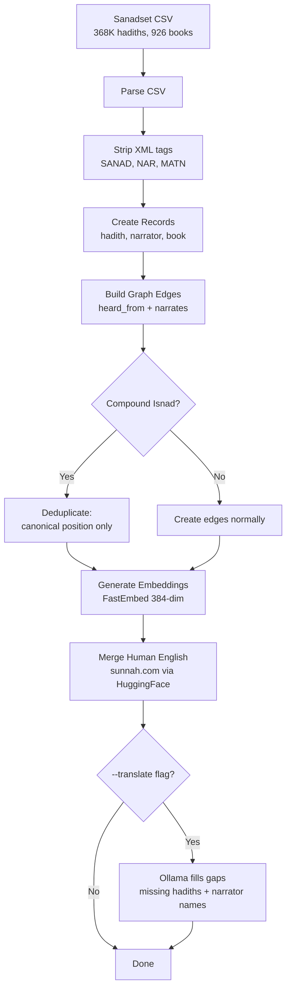
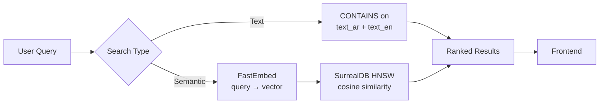
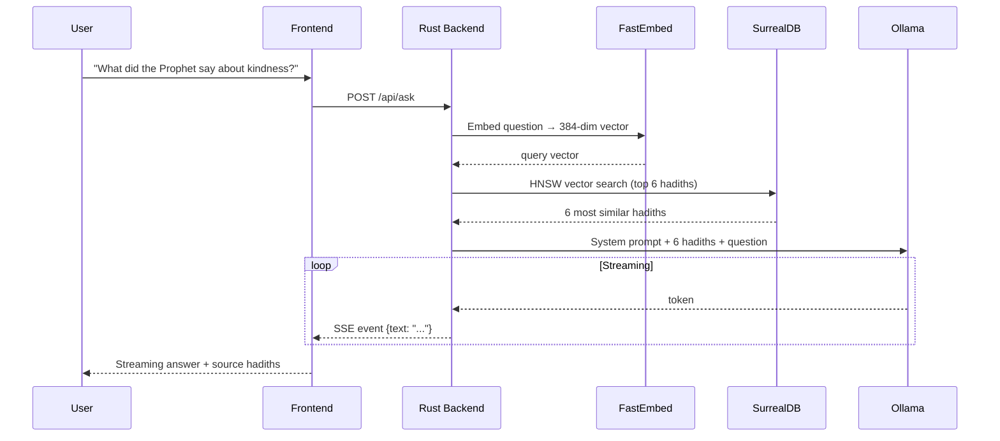
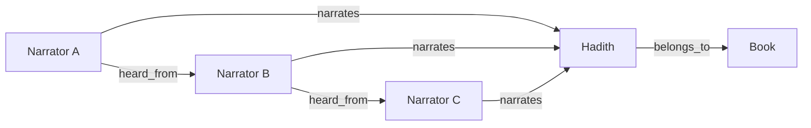

# Hadith Explorer

Browse, search, and explore Islamic hadith collections with narrator chain (isnad) visualization and RAG-powered Q&A — all running locally.

## Architecture Overview

```
┌─────────────────────────────────────────────────────────┐
│                    SvelteKit Frontend                   │
│  Dashboard │ Hadiths │ Narrators │ Search │ Ask (RAG)   │
└──────────────────────┬──────────────────────────────────┘
                       │ JSON API
┌──────────────────────┴──────────────────────────────────--┐
│                   Rust / Axum Backend                     │
│                                                           │
│  ┌─────────┐   ┌──────────┐  ┌─────────┐  ┌───────────┐   │
│  │ Handlers │  │  Search  │  │   RAG   │  │  Ingest   │   │
│  │ (JSON)   │  │ Text+Vec │  │ Ollama  │  │ Sanadset  │   │
│  └────┬─────┘  └────┬─────┘  └────┬────┘  └─────┬─────┘   │
│       │             │             │              │        │
│  ┌────┴─────────────┴─────────────┴──────────────┴────-┐  │
│  │              SurrealDB (SurrealKV)                  │  │
│  │  hadiths │ narrators │ books │ heard_from │ narrates│  │
│  │  HNSW vector index │ graph traversal                │  │
│  └──────────────────────────────────────────────────── ┘  │
│                                                           │
│  ┌──────────────┐  ┌──────────────-┐                      │
│  │  FastEmbed   │  │   Ollama      │                      │
│  │  (embeddings)│  │  (local LLM)  │                      │
│  └──────────────┘  └──────────────-┘                      │
└─────────────────────────────────────────────────────────--┘
```

### Ingest Pipeline



### Search Flow



### Ask (RAG) Flow



### Database Graph Model



## Setup

### Prerequisites

- [Rust](https://rustup.rs/) (latest stable)
- [Node.js](https://nodejs.org/) (v20+)
- [Ollama](https://ollama.ai/) (for fallback translation and Ask feature)

### Install Ollama

```bash
brew install ollama        # macOS
ollama pull qwen3:8b       # recommended for translation + Ask
ollama serve               # start the Ollama server
```

### Build

```bash
make build
# or manually:
cd frontend && npm install && npm run build && cd ..
cargo build
```

## Data Sources

### Sanadset 650K (Arabic text + narrator chains)

The [Sanadset 650K dataset](https://data.mendeley.com/datasets/5xth87zwb5/4) provides 368K+ hadiths from 926 Arabic hadith books with pre-parsed narrator chains (isnad).

**CSV columns used:**

| Column | Content | How we use it |
|---|---|---|
| `Hadith` | Full Arabic text with `<SANAD>`, `<NAR>`, `<MATN>` tags | Stored as `text_ar` (tags stripped) |
| `Book` | Arabic book name | Stored as `book_name`, used for grouping |
| `Num_hadith` | Hadith number within the book | Join key for English translations |
| `Matn` | Just the hadith content (no isnad) | Stored as `matn`, used for Ollama translation |
| `Sanad` | Pre-parsed narrator chain as Python list | Used to create narrator records + chain edges |
| `Sanad_Length` | Number of narrators | Validation |

**Auto-downloaded** during first ingest if `data/sanadset.csv` is not present. The zip (~150MB) is downloaded from Mendeley Data and the largest CSV is extracted automatically.

Manual download: visit https://data.mendeley.com/datasets/5xth87zwb5/4

### Sunnah.com English Translations (human-quality)

For the 6 major hadith collections (Kutub al-Sittah), human English translations are automatically downloaded from [HuggingFace](https://huggingface.co/datasets/meeAtif/hadith_datasets) during ingest:

| Book | Arabic Name | Hadiths |
|---|---|---|
| Sahih al-Bukhari | صحيح البخاري | ~7,000 |
| Sahih Muslim | صحيح مسلم | ~5,000 |
| Sunan Abi Dawud | سنن أبي داود | ~4,300 |
| Sunan an-Nasa'i | سنن النسائى الصغرى | ~5,500 |
| Jami at-Tirmidhi | سنن الترمذي | ~3,900 |
| Sunan Ibn Majah | سنن ابن ماجه | ~4,300 |

Translations are matched by hadith number and cached in `data/translations/`.

## Ingest

```bash
# List all 926 available books
cargo run -- ingest --list-books

# Ingest the 6 major books (default) with human English translations
cargo run -- ingest --limit 10           # quick test: 10 hadiths per book
cargo run -- ingest                      # full: all hadiths from 6 major books

# With Ollama fallback for any missing translations
cargo run -- ingest --translate          # human English + Ollama fills gaps
cargo run -- ingest --translate --translate-model qwen3:8b

# Ingest specific books by number (from --list-books output)
cargo run -- ingest --books 1,8,13

# Ingest all 926 books
cargo run -- ingest --all --translate

# Fresh start
rm -rf db_data && cargo run -- ingest --translate
```

### How translation works

The ingest pipeline has a two-tier translation system:

**Tier 1 — Human translations (always runs, instant):**
1. Downloads sunnah.com English CSVs from HuggingFace for the 6 major books
2. Matches each hadith by number and updates `text_en` with the human translation
3. Extracts English narrator names from "Narrated X:" prefixes

**Tier 2 — Ollama fallback (with `--translate` flag):**
1. Scans all hadiths where `text_en` is still missing (other books, or gaps in sunnah.com data)
2. Translates the `matn` (hadith content only, not the isnad preamble) via Ollama
3. Transliterates narrator names that don't have English yet (batched 20 at a time for speed)

### Compound isnad handling

Some hadiths have multiple parallel chains of narration (compound isnads), indicated by `ح` (haa' al-tahweel) in the Arabic text. The Sanadset dataset flattens these into a single list, which can create incorrect narrator relationships.

Our solution: when creating `heard_from` edges, we only create an edge between consecutive narrators if **both are at their last (canonical) position** in the chain. A narrator's last occurrence represents their true position in the transmission hierarchy. We also use diacritics-stripped comparison (`slug_bare()`) for duplicate detection, since the same narrator may appear with different tashkeel.

## Run

```bash
cargo run -- serve --port 3000

# Or use Make
make dev     # build + start in background
make stop    # stop background server
```

Open http://localhost:3000

### Server options

```bash
cargo run -- serve --port 3000 \
  --ollama-url http://localhost:11434 \
  --ollama-model qwen3:8b
```

## Features

### Browse
- Dashboard with stats (hadith/narrator/book counts) and book grid
- Hadith list with pagination, filterable by book
- Narrator list with hadith counts, searchable
- Book listing

### Hadith Detail
- Arabic text with matn (hadith content) highlighted in quotes
- English translation (human or Ollama) in green serif blockquote
- Narrator chips (clickable, navigate to narrator detail)
- Narrator chain — clean card-based vertical visualization showing the isnad from Prophet/Companion down to the compiler

### Narrator Detail
- Bilingual name (Arabic + English)
- Three tabs: **Network** (Cytoscape.js graph of teachers/students), **Hadiths** (all hadiths narrated), **Connections** (teacher/student chips)
- Deduplication of hadiths (handles multiple narrates edges from compound isnads)

### Search
- Bilingual: searches both Arabic and English text
- Text search: substring matching on hadith text and narrator names
- Semantic search: FastEmbed converts query to vector, HNSW cosine similarity finds hadiths by meaning

### Ask (RAG)
- Chat interface for asking questions about hadiths
- **How it works:**
  1. Your question is converted to a 384-dimension vector by FastEmbed
  2. SurrealDB's HNSW index finds the 6 most semantically similar hadiths
  3. These hadiths are injected as context into a prompt sent to Ollama
  4. Ollama generates an answer grounded in the actual hadith text
  5. Response streams back token-by-token via Server-Sent Events (SSE)
- Source hadiths shown as collapsible cards below the answer
- Suggestion chips for common questions

## Makefile Commands

```bash
make build        # build backend + frontend
make dev          # build + start server in background
make stop         # stop background server
make server       # build + start server in foreground
make ingest       # full ingest (Arabic + human English)
make ingest-test  # quick test: 5 per book + Ollama translation
make ingest-full  # full 6 books + Ollama translation
make list-books   # show all 926 available books
make clean        # wipe all generated data
```

## Project Structure

```
hadith/
├── Cargo.toml                    # Rust dependencies
├── Makefile                      # Build/run shortcuts
├── README.md
├── data/
│   ├── sanadset.csv              # Sanadset 650K (auto-downloaded)
│   └── translations/             # Cached sunnah.com English CSVs
├── db_data/                      # SurrealDB data (generated)
├── src/
│   ├── main.rs                   # CLI: Ingest + Serve commands
│   ├── db.rs                     # SurrealDB connection + schema
│   ├── models.rs                 # Data types (Hadith, Narrator, Book, API responses)
│   ├── embed.rs                  # FastEmbed vector generation
│   ├── search.rs                 # Text + semantic search
│   ├── rag.rs                    # Ollama RAG client (Ask feature)
│   ├── ingest/
│   │   ├── mod.rs
│   │   └── sanadset.rs           # Sanadset CSV parsing, chain building, translation
│   └── web/
│       ├── mod.rs                # Axum router + SPA serving
│       └── handlers.rs           # All API endpoints
└── frontend/
    ├── svelte.config.js          # SvelteKit SPA config (adapter-static)
    ├── vite.config.ts            # Vite dev proxy
    ├── src/
    │   ├── app.css               # Global styles (light theme, Noto Naskh Arabic)
    │   ├── routes/
    │   │   ├── +layout.svelte    # Sidebar + TopBar shell
    │   │   ├── +page.svelte      # Dashboard
    │   │   ├── hadiths/
    │   │   │   ├── +page.svelte  # Hadith list
    │   │   │   └── [id]/+page.svelte  # Hadith detail
    │   │   ├── narrators/
    │   │   │   ├── +page.svelte  # Narrator list
    │   │   │   └── [id]/+page.svelte  # Narrator detail
    │   │   ├── books/+page.svelte
    │   │   ├── search/+page.svelte
    │   │   └── ask/+page.svelte  # RAG chat
    │   └── lib/
    │       ├── api.ts            # Typed API client
    │       ├── types.ts          # TypeScript interfaces
    │       ├── utils.ts          # Helpers (truncate, stripHtml)
    │       └── components/
    │           ├── layout/       # Sidebar, TopBar
    │           ├── common/       # Badge, Pagination, LoadingSpinner
    │           ├── hadith/       # HadithCard
    │           ├── narrator/     # NarratorCard, NarratorChip
    │           └── graph/        # ChainView (cards), GraphView (Cytoscape)
    └── build/                    # Production build (generated)
```

## API Endpoints

| Method | Endpoint | Description |
|---|---|---|
| GET | `/api/stats` | Hadith/narrator/book counts |
| GET | `/api/books` | All books |
| GET | `/api/hadiths?book=&page=&limit=` | Paginated hadith list |
| GET | `/api/hadiths/{id}` | Hadith detail + narrators |
| GET | `/api/narrators?q=&page=&limit=` | Paginated narrator list |
| GET | `/api/narrators/{id}` | Narrator + hadiths + teachers + students |
| GET | `/api/search?q=&type=text\|semantic` | Bilingual search |
| GET | `/api/chain/{hadith_id}` | Narrator chain graph data |
| GET | `/api/narrators/{id}/graph` | Narrator network graph data |
| POST | `/api/ask` | RAG Q&A (SSE streaming) |
| POST | `/api/internal/translate` | Update translations (internal) |

## Database Schema

SurrealDB with SurrealKV backend. Graph-capable document store.

**Tables:**
- `hadith` — hadith_number, book_id, text_ar, text_en, matn, narrator_text, book_name, embedding (384-dim float vector)
- `narrator` — name_ar, name_en, search_name
- `book` — book_number, name_en, name_ar

**Relations (graph edges):**
- `heard_from` — narrator → narrator (isnad chain: student heard from teacher)
- `narrates` — narrator → hadith (who narrated which hadith)
- `belongs_to` — hadith → book

**Indexes:**
- HNSW vector index on `hadith.embedding` for semantic search

## Tech Stack

| Layer | Technology | Purpose |
|---|---|---|
| Backend | Rust, Axum | HTTP server, JSON API |
| Database | SurrealDB (SurrealKV) | Document store + graph + vector search |
| Embeddings | FastEmbed (multilingual-e5-small) | 384-dim vectors for semantic search |
| Frontend | SvelteKit 2, Svelte 5 | SPA served as static files |
| Graph viz | Cytoscape.js | Narrator network visualization |
| LLM | Ollama (local) | Translation fallback + RAG Q&A |
| Data | Sanadset 650K | Arabic hadith text + narrator chains |
| Translations | sunnah.com / HuggingFace | Human English for 6 major books |

## Contributing

### Development setup

```bash
git clone <repo>
cd hadith
make build

# Quick test data
cargo run -- ingest --limit 5 --translate

# Start dev
make dev
# Frontend dev server with hot reload:
cd frontend && npm run dev
```

### Key areas for contribution

- **More hadith books with English translations** — currently only 6 major books have human translations
- **Arabic NLP** — better compound isnad parsing, narrator name disambiguation
- **UI/UX** — improved chain visualization, mobile responsive, accessibility
- **Search** — BM25 full-text search (blocked by SurrealDB v3 syntax changes)
- **Narrator metadata** — generation (tabaqat), reliability grading, biographical data
- **Performance** — batch DB operations during ingest, pagination optimization
