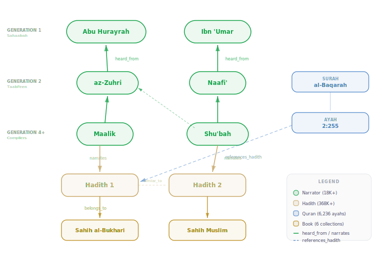

# Introducing Ilm: Searching the Quran and Sunnah with Graph, Vector, and Full-Text — In One Database

بسم الله الرحمن الرحيم

---

**A note before we begin.** This tool is for study and research. It is not a replacement for consulting qualified scholars. The Quran and Sunnah are the sources of Islamic law, but extracting rulings from them requires deep knowledge of the Arabic language, the principles of *usool al-fiqh*, the conditions of application, and the broader evidences. For rulings (*fatwas*) and their application, one must approach the scholars of knowledge directly. This project reports what the texts say and what the classical scholars of hadith have documented — it does not issue verdicts.

---

## The Two Sources

The Quran and the Sunnah are the two objective sources of knowledge for Muslims. The Quran is the word of Allah, preserved letter by letter through *mutawaatir* recitation chains spanning fourteen centuries. The Sunnah — the practice, statements, and approvals of the Prophet Muhammad (peace be upon him) — is preserved through the science of hadith: a rigorous chain-of-custody system where every report is traced, narrator by narrator, back to the Prophet himself.

The word **'ilm** (عِلْم) — knowledge — appears throughout the Quran. Allah says, *"Say: Are those who know equal to those who do not know?"* (az-Zumar 39:9). The pursuit of knowledge from these two sources is not merely encouraged; it is the foundation upon which the religion is built.

This project is called **Ilm** because that is what it serves: making the Quran and the authenticated Sunnah searchable, analyzable, and accessible for study — using modern computational tools, while staying grounded in the classical Islamic scholarly methodology that preserved these sources.

Ilm is an open-source platform built in Rust that combines:

- **The Quran** — 114 surahs with Tajweed Arabic, English translation, Tafsir Ibn Kathir, word-by-word morphological analysis, early manuscript images, and similar phrase detection
- **The Sunnah** — 368,000+ hadiths from the six canonical collections with full Arabic and English text, narrator chains, scholarly grades, and cross-references to Quran verses
- **18,000+ narrators** — with biographical data, reliability assessments from classical scholars, and interactive graph visualization of teacher-student transmission networks
- **Isnad analysis** — computational implementation of *mustalah al-hadith* (hadith terminology): chain continuity, transmission breadth, pivot narrator detection, and word-level text comparison between hadith variants
- **Hybrid search** — bilingual (Arabic + English) full-text search fused with semantic vector search using Reciprocal Rank Fusion
- **AI-powered Q&A** — natural language questions answered from Quran and Hadith sources, running entirely locally via Ollama with no data leaving the machine
- **Personal study notes** — annotate any ayah or hadith, collect evidence by topic with inline @mentions that embed Quran verses and hadiths as rich cards

Under the surface, this project models a directed graph of 18,000+ historical scholars spanning ten generations, where each edge carries metadata about which of 368,000 texts it belongs to and where in the chain it falls. That graph must be searchable by meaning across two languages, by keyword with language-specific stemming, and by structural topology — all at once, in a single query. The classification system that governs how these narrations are evaluated has dozens of interacting dimensions: chain continuity, narrator reliability, route count, textual comparison between variants, and more.

Every table, every graph edge, every index in the database exists to serve a specific concept from the classical science of hadith evaluation. The domain *is* the requirements document. Before showing the architecture and the queries, the article walks through this domain in depth — because no design decision makes sense without it.

If you study hadith science, you will recognize these concepts and see how they map to a graph database. If you build search systems or work with databases, you will see why this domain needs graph traversal, vector similarity, and full-text search working together — and what that looks like in practice.

<p align="center">
  
</p>

---

## Anatomy of a Hadith: Sanad and Matn

A **hadith** (حديث — literally: something new) is, technically, any statement, action, approval, or description ascribed to the Prophet (peace be upon him). Related terms include **khabar** (خبر — report, sometimes used as a synonym, sometimes more general) and **athar** (أثر — remnant, often referring to statements ascribed to the Companions and their Followers).

Every hadith has two parts:

**The sanad** (سند — literally: something depended upon for support) is the chain of individuals connected to the text. It is called *sanad* because the hadith leans on it for support and relies on it for authority.

**The matn** (متن — literally: the hard, raised part of the ground) is the text at which the sanad ends — the actual content of the report.

Here is a concrete example from Sahih al-Bukhari:

> **Al-Bukhari said**: 'Abdullaah ibn Yoosuf narrated to us, **saying** Maalik informed us, **from** Ibn Shihaab, **from** Muhammad ibn Jubayr ibn Mut'im, **from** his father, **who said**: "I heard the Messenger of Allah (peace be upon him) recite *Soorah at-Toor* in the Maghrib prayer."

Everything before "I heard the Messenger of Allah..." is the **sanad** — a chain of five narrators linking al-Bukhari (d. 256 AH) back to Jubayr ibn Mut'im, a Companion who heard the Prophet directly. Everything after it is the **matn** — the actual report.

The narrators in a chain belong to **tabaqaat** (طبقات — generational layers):

| Generation | Arabic | Who |
|---|---|---|
| 1 | صحابي (Sahabi) | Companions of the Prophet |
| 2 | تابعي (Tabi'i) | Followers — those who met the Companions |
| 3 | تابع التابعين (Tabi' at-Tabi'in) | Followers of the Followers |
| 4+ | Later generations | Continuing through to the compilers |

A typical chain is 5-10 narrators deep. Some chains in the Ilm dataset are 15 or more nodes deep. The compiler (like al-Bukhari, d. 256 AH / 870 CE) sits at the bottom of the chain; the Prophet sits at the top. Each link between two narrators represents a transmission: "I heard from," "he narrated to us," "he reported to us."

The **isnad** (إسناد) has two meanings: (a) attributing a statement to the one who made it, and (b) the chain of individuals connected to the matn — essentially synonymous with sanad. The isnad is a narrator-by-narrator audit trail. It is the core innovation of hadith science — a systematic source-criticism methodology that predates modern academic criticism by centuries.

Imam Muslim (d. 261 AH / 875 CE) wrote in the introduction to his *Sahih*: **"The isnad is part of the religion; were it not for the isnad, anyone could say whatever they wished."**

The preservation of hadith involved specific methods of receiving and conveying narrations. Scholars documented eight methods of **tahammul** (receiving hadith):

1. **Samaa'** (سماع) — hearing directly from the shaykh's words. The highest method according to the majority.
2. **Qiraa'ah / 'Ard** (قراءة / عرض) — the student reads to the shaykh, who listens and confirms.
3. **Ijaazah** (إجازة) — verbal or written permission to narrate.
4. **Munawalah** (مناولة) — the shaykh hands his book to the student.
5. **Kitaabah** (كتابة) — written correspondence.
6. **I'laam** (إعلام) — declaration: the shaykh declares he heard a certain hadith.
7. **Wasiyyah** (وصية) — bequeathing books at time of death or travel.
8. **Wijaadah** (وجادة) — finding written hadith without a chain of permission.

Each method has specific phrases that indicate how the hadith was received: *haddathanaa* (he narrated to us) indicates *samaa'*, *akhbaranaa* (he reported to us) indicates *qiraa'ah*, *anba'anaa* (he informed us) indicates *ijaazah*. These phrases are not interchangeable — they are technical indicators that scholars use to evaluate the strength of the link.

So how do scholars evaluate whether a chain is authentic? This is where the science of *mustalah al-hadith* begins.

<p align="center">
  
</p>

---

## The Science of Mustalah al-Hadith

This science did not originate as an academic exercise invented centuries after the Prophet. Its foundation is in the Noble Quran itself. Allah, the Exalted, says:

> **"O you who believe! If a faasiq (evil person) comes to you with news, verify it."** (al-Hujuraat 49:6)

And the Messenger of Allah (peace be upon him) said:

> **"May Allah brighten the person who heard something from us, then conveyed it just as he heard it. Perhaps the one to whom it was conveyed understands more thoroughly than the one who heard it."** (at-Tirmidhi)

The foregoing verse and hadith provide the basis for verifying narrations before accepting them, as well as accurately memorizing, preserving, and transmitting them. The Companions (may Allah be pleased with them) were the first practitioners — they verified narrations, cross-checked reports, and applied these principles. As Ibn Seereen stated: **"Previously, they did not ask about the isnad. However, when the *fitnah* (civil strife) occurred, they said, 'Name to us your men.' So the narrations of the adherents to the Sunnah were accepted, while those of Ahlul-Bid'ah (adherents to innovation) were not accepted."** (Introduction of *Sahih Muslim*)

The science became formalized as an independent discipline in the fourth century after the Hijrah, with ar-Raamahurmuzee (d. 360 AH) authoring the first work devoted exclusively to the subject: *al-Muhaddith al-Faasil baynar-Raawee wal-Waa'ee*. Over the following centuries, scholars produced increasingly comprehensive works, including al-Haakim's *Ma'rifah 'Uloom al-Hadeeth*, Ibn as-Salaah's *Muqaddimah* (commonly known as *'Uloom al-Hadeeth*), an-Nawawee's abridgements, Ibn Hajar's *Nukhbah al-Fikar*, and as-Suyootee's *Tadreeb ar-Raawee*.

### Classification by How It Reached Us

The first axis of classification concerns **how many independent routes** a hadith has been transmitted through.

**Mutawatir** (متواتر — literally: following one another consecutively). What has been narrated by such a large number that it is inconceivable they collaborated to propagate a lie.

Four conditions must be met:
1. A large number of people narrate it — the chosen opinion for the minimum is **ten**
2. This large number is present at **all levels** of the chain, not just one
3. It is inconceivable that they could have collaborated to propagate a lie
4. The report is based upon sense perception: "we heard" or "we saw"

*Ruling*: The *mutawatir* conveys *'ilm darooree* (certain knowledge), such that one is obliged to decisively accept it, as if he witnessed the matter himself.

Two categories: **Lafthee** (*mutawatir* in both wording and meaning) and **Ma'nawee** (*mutawatir* in meaning, but narrated with different wordings).

**Aahaad** (آحاد — literally: plural of *ahad*, meaning one). A narration that does not fulfill the conditions of being *mutawatir*.

*Ruling*: Conveys *'ilm natharee* (knowledge that must be investigated) — acceptance is conditional upon examination of the chain and narrators.

Aahaad hadiths are further categorized by the number of routes:

| Category | Arabic | Definition | Threshold |
|---|---|---|---|
| **Mashhur** | مشهور (publicized) | Narrated by 3+ at each tabaqah, below mutawatir | ≥ 3 per level |
| **'Aziz** | عزيز (strong) | No less than 2 narrators at every level of the sanad | ≥ 2 at every level |
| **Gharib** | غريب (alone) | Reported by one narrator only at some level | = 1 at some level |

**Important**: *Mashhur* can be *sahih*, *hasan*, *da'eef*, or even *mawdu'*. The classification is about **route count**, not quality. A hadith narrated through many chains can still be weak if the narrators are unreliable.

**Gharib** has two sub-types:
- **Gharib Mutlaq** (also called *Fard Mutlaq*): only one narrator at the root of the sanad. Example: the hadith of intentions — "Indeed, actions are only by intentions" — narrated only by 'Umar ibn al-Khattab (may Allah be pleased with him) at the Companion level.
- **Gharib Nisbee** (also called *Fard Nisbee*): only one narrator at a later point in the sanad, while the root may have multiple narrators.

### Classification by Acceptance and Rejection

This is the classification that determines whether a hadith can be used as proof.

#### Accepted Narrations

**Sahih li-Thaatihi** (صحيح لذاته — sound on its own merit). This is the gold standard. It requires **five conditions**:

1. **Connected sanad (ittisal)**: every narrator reported directly from the one prior to him, all through the sanad from beginning to end.
2. **'Adaalah** (uprightness): every narrator is Muslim, *baaligh* (mature), *'aaqil* (of sound mind), not a *faasiq* (open sinner), and not *makhroom al-muroo'ah* (compromising overall integrity).
3. **Dabt** (precision): every narrator is *taamm ad-dabt* (completely retentive), whether it be *dabt as-sadr* (retention by heart) or *dabt al-kitaab* (retention by writing).
4. **Absence of shuthooth**: no contradiction by a *thiqah* (trustworthy narrator) against someone even more reliable.
5. **Absence of 'illah**: no hidden, obscure defect that impairs the authenticity of the hadith, although it appears to not have any such defect.

*Ruling*: Used as proof, and must be implemented based on the consensus of the scholars of hadith, usool, and fiqh.

The two most prominent collections of *sahih* narrations are *Sahih al-Bukhari* (d. 256 AH) and *Sahih Muslim* (d. 261 AH). Bukhari's collection is considered more authentic because: (a) the connections between the narrators are stronger, (b) the narrators in its chains are more reliable, and (c) it contains more *fiqh* (legal deductions). That said, Muslim may contain individual hadiths that are stronger than some found in Bukhari.

**Hasan li-Thaatihi** (حسن لذاته — beautiful on its own merit). Same conditions as *sahih*, but the narrator has a **lesser degree of dabt** — for instance, a narrator described as *sadooq* (truthful) rather than *thiqah* (trustworthy). *Ruling*: Used as proof, just as the *sahih*, despite not being as strong.

**Sahih li-Ghayrihi** (صحيح لغيره — sound due to other factors). A *hasan li-thaatihi* narration when it is reported through another similar route or one even stronger. Its being *sahih* does not result from its own sanad — rather, it only results from combining others with it. *Rank*: Above *hasan li-thaatihi*, below *sahih li-thaatihi*.

**Hasan li-Ghayrihi** (حسن لغيره — beautiful due to other factors). A *da'eef* narration when it has numerous routes, and the reason for it being *da'eef* is **not** *fisq* (open sinfulness) or *kathib* (lying). The *da'eef* ascends to *hasan li-ghayrihi* when: (1) it is reported through one or more other routes similar or greater in strength, and (2) the reason for being *da'eef* is either poor memory, a break in the sanad, or *jahaalah* (not knowing a narrator). *Ruling*: Among the accepted narrations used as proof, though lower than *hasan li-thaatihi*.

**Critical principle**: A *da'eef* narration due to severe weakness — *fisq*, *kathib* (lying), or fabrication — is **never** elevated regardless of how many routes it has. Only light weakness can be remedied through corroboration.

#### Rejected Narrations — Due to Omission in the Isnad

| Type | Arabic | Definition | Severity |
|---|---|---|---|
| **Mu'allaq** | معلق (hanging) | One or more consecutive narrators omitted from the **beginning** of the isnad | Rejected — no connected isnad |
| **Mursal** | مرسل (set free) | A Tabi'i says "The Messenger of Allah said..." — omitting the Sahabi | Da'eef — identity of Sahabi unknown |
| **Mu'dal** | معضل (incapacitated) | Two or more **consecutive** narrators omitted | Worst type of break |
| **Munqati'** | منقطع (disconnected) | Any break not fitting the above categories | Da'eef by scholarly consensus |
| **Mudallas** | مدلس (concealed) | Narrator conceals a flaw using ambiguous phrasing like *'an* (from) | Extremely undesirable |
| **Mursal Khafee** | مرسل خفي (hidden mursal) | Reports from someone he met but didn't directly hear from | Da'eef — a type of munqati' |

Severity ranking (worst to mildest): Mu'dal > Munqati' > Mudallas > Mursal

#### Rejected Narrations — Due to Disparagement of the Narrator

Rejection due to the narrator falls into two categories: disparagement of **'adaalah** (character) and disparagement of **dabt** (precision).

**Disparagement of 'Adaalah:**

| Cause | Arabic | Resulting Classification |
|---|---|---|
| Kathib (lying) | كذب | **Mawdu'** (fabricated) — the worst type of all |
| Accused of lying | تهمة بالكذب | **Matrook** (abandoned) |
| Fisq (open sinfulness) | فسق | **Munkar** (disapproved) |
| Bid'ah (innovation) | بدعة | **Da'eef** (weak) |
| Jahaalah (being unknown) | جهالة | **Da'eef** (weak) |

**Disparagement of Dabt:**

| Cause | Arabic | Resulting Classification |
|---|---|---|
| Fuhsh al-ghalat (gross error) | فحش الغلط | **Munkar** |
| Soo' al-hifth (poor memory) | سوء الحفظ | **Da'eef** |
| Ghaflah (negligence) | غفلة | **Munkar** |
| Kathrah al-awhaam (many mistakes) | كثرة الأوهام | **Mu'allal** (defective) |
| Mukhaalafah ath-thiqaat (contradicting trustworthy narrators) | مخالفة الثقات | **Mudraj**, **Maqloob**, **Mudtarib**, **Musahhaf**, or **Shaath** |

**Shaath** versus **Munkar**: *Shaath* is what an **acceptable** narrator reports in contradiction to someone more reliable — its opposite is *mahfooth* (preserved), which is accepted. *Munkar* is what a **da'eef** narrator reports in contradiction to a *thiqah* — its opposite is *ma'roof* (known), which is accepted.

### Classification by Whom It Is Ascribed To

| Type | Arabic | Ascribed to | Notes |
|---|---|---|---|
| **Qudsee** | قدسي (sacred) | Allah in meaning, the Prophet in wording | Not Quran; 200+ narrations |
| **Marfoo'** | مرفوع (raised) | The Prophet | Statement, action, approval, or description |
| **Mawqoof** | موقوف (stopped) | A Sahabi | May be sahih, hasan, or da'eef |
| **Maqtoo'** | مقطوع (severed) | A Tabi'i or later | Cannot be used for legal rulings |

### Narrator Assessment: Al-Jarh wat-Ta'deel

Every narrator in every chain is individually evaluated by the scholars of *al-jarh wat-ta'deel* (disparagement and validation). This is the science of *'ilm ar-rijal* (knowledge of the men) — biographical dictionaries containing assessments of tens of thousands of narrators.

The grades of **ta'deel** (validation), from highest to lowest:

1. **Superlative trustworthiness and reliability**: *athbat an-naas* (the firmest of people), *awthaq* (most trustworthy). Their narrations are used as proof, and some are stronger than others at this level.

2. **Emphasized reliability**: *thiqatun thabt* (trustworthy and firm), *thiqatun ma'moon* (trustworthy and trusted), *thabtun hujjah* (firm and a proof). Used as proof.

3. **Simple reliability, without emphasis**: *thiqah* (trustworthy), *hujjah* (proof), *'adlun daabit* (upright and retentive). Used as proof.

4. **Validation without the sense of dabt**: *sadooq* (honest), *mahalluhu as-sidq* (his station is truthfulness), *laa ba'sa bihi* (no objection to him). Their narrations are **not** used as proof alone; they are collected and examined.

5. **Neither reliability nor disparagement**: *shaykh*, *wasat* (acceptable), *ilaa as-sidqi maa huwa* (inclined to truthfulness). Not used as proof; collected and examined, though lower than the fourth grade.

6. **Near disparagement**: *saalih al-hadeeth* (fit to report hadith), *yuktabu hadeethuhu* (his hadith is written), *yu'tabaru bihi* (given consideration for corroboration). Their hadith are written for *i'tibaar* (corroboration) only, not proof, due to their apparent lack of *dabt*.

The grades of **jarh** (disparagement), from mildest to severest:

1. **Indicates carelessness**: *layyin al-hadeeth* (of little weight), *feehi maqaal* (statements have been leveled at him). Their hadith can be written for *i'tibaar*.

2. **Cannot be used as proof**: *laa yuhtajju bihi* (not used as proof), *da'eef* (weak), *lahu manaakeer* (has *munkar* reports). Can be written for *i'tibaar* but lower than the first grade.

3. **Not to be written**: *laa yuktabu hadeethuhu* (his hadith is not to be written), *da'eef jiddan* (very weak), *tarahoo hadeethahu* (they discarded his hadith). Not written, not for *i'tibaar*.

4. **Accused of lying**: *muttahamun bil-kathib* (accused of lying), *muttahamun bil-wad'* (accused of fabrication), *saaqit* (notorious). Not written, not for *i'tibaar*.

5. **Known liar**: *kaththaab* (established liar), *waddaa'* (established fabricator), *yakthib* (tells lies). Not written.

6. **Superlative lying**: *akthab an-naas* (the most dishonest of people), *ilayhi al-muntahaa fil-kathib aw al-wad'* (lying or fabrication gets no worse than him), *rukn al-kathib* (the cornerstone of lying). Not written.

**Rulings on the grades of jarh**: The first and second — their hadith can be written for *i'tibaar* only. The last four — their narrations cannot be used as proof, nor should they be written, nor are they to be used for *i'tibaar*.

**A critical rule**: Ta'deel (validation) is accepted without explanation, because its reasons are many and difficult to enumerate. Jarh (disparagement) is **not** accepted unless explained, because there are different reasons for disparagement, and someone may be undeservingly disparaged on invalid grounds. If both jarh and ta'deel exist for one narrator, **jarh is given precedence** as long as it is explained.

<p align="center">
  
</p>

The primary source for narrator reliability in the Ilm project is **Ibn Hajar al-Asqalani's** (d. 852 AH) ***Taqrib al-Tahdhib*** — an abridgement of al-Mizzi's comprehensive *Tahdhib al-Kamal*, which itself is the standard biographical dictionary of the narrators found in the six canonical collections.

### How Quran and Hadith Connect

The Quran and the Sunnah are inseparable sources. The Sunnah explains what is general in the Quran, specifies what is unrestricted, and supplements what is not explicitly addressed. Many ayahs are understood fully only in light of the hadith that explain them, and many hadiths reference specific Quranic verses.

In the Ilm database, this relationship is modeled as `references_hadith` edges connecting ayahs to hadiths — curated mappings from Quran.com that answer "which hadiths explain this ayah?" and "which ayahs does this hadith reference?"

---

## Why This Is Hard to Build

Now that the reader understands the domain, consider what a database must handle to model it computationally.

**1. Deep graph traversal.** Narrator chains are directed acyclic graphs 10-15+ nodes deep. You need to walk `heard_from` edges from the compiler (like al-Bukhari) back to the Prophet, compute reachability sets (which narrators can reach which terminal narrators), detect bottleneck narrators (*madar al-isnad* — the pivot the chain revolves around), identify common ancestors across variant chains, and validate chronological plausibility (a student's generation must not predate his teacher's). This is textbook graph database territory — except you also need everything below.

**2. Full-text bilingual search.** 368,000+ hadith texts in both Arabic and English. Arabic needs a dedicated tokenizer — Arabic morphology is too rich for a generic stemmer. The same three-letter root produces dozens of surface forms through patterns of vowels, prefixes, and suffixes. English gets standard BM25 with snowball stemming ("praying" matches "prayer"). Searches across both languages must be fused into a single ranked result list.

**3. Vector search at scale.** Semantic similarity across 368K hadith texts and 6,236 Quran ayahs using 1024-dimensional embeddings (BGE-M3, a multilingual model). When a user asks "what did the Prophet say about night prayer?", the system needs to find semantically relevant hadiths even if they use different words — and it needs to do this in milliseconds using an HNSW (Hierarchical Navigable Small World) index, not a brute-force scan.

**4. Metadata on edges.** The `heard_from` relationship between two narrators is not just a connection — it carries `hadith_ref` (which specific hadith this transmission link belongs to) and `chain_position` (where in the chain this link falls). The `narrates` edge carries `chain_position`. Edges are first-class data carriers with their own fields, not mere pointers.

**5. Fusion in a single query path.** The hybrid search fuses BM25 results from English text, BM25 results from Arabic text, and vector KNN results using Reciprocal Rank Fusion (RRF) — all in one database round-trip. Not three separate API calls stitched together with application-level orchestration.

**6. Relational queries alongside everything else.** You still need paginated hadith lists filtered by book, narrator directories filtered by generation, chapter structures, user notes with tag-based queries. The database must handle standard relational CRUD alongside graph traversal and vector search.

**The traditional multi-database approach** would require: **Neo4j** or Dgraph for the narrator graph, **Elasticsearch** for full-text Arabic and English search, **Pinecone** or Weaviate for vector embeddings, and **PostgreSQL** for the relational queries. That is 3-4 services to deploy, 3-4 query languages to learn, 3-4 connection pools to manage, and custom orchestration code to join results across them. Every query like "find hadiths similar to this question and show me the narrator chain" requires coordinating across multiple databases.

This orchestration complexity is what prevented this project from being built for years. I had attempted it multiple times, each time getting blocked by the cost of wiring together separate databases that each excelled at one capability but could not do the others.

What if one database could handle all of this?

---

## Architecture: Rust, SvelteKit, and One Database

The architecture is simple because the database handles the complexity:

- **Backend**: Rust with Axum (async HTTP framework)
- **Frontend**: SvelteKit 2 with Svelte 5 (static SPA served by Axum)
- **Database**: SurrealDB, embedded via SurrealKV — no separate server process
- **Embeddings**: FastEmbed with BGE-M3 (1024-dim, multilingual)
- **LLM**: Ollama running locally for GraphRAG Q&A

SurrealDB provides everything the domain requires in a single embedded engine:

- **`TYPE RELATION` tables** — graph edges are first-class citizens with their own fields. `heard_from` is a relation from `narrator` to `narrator` that carries `hadith_ref` and `chain_position`. No need for a separate graph database.
- **HNSW vector indexes** — `DEFINE INDEX ... HNSW DIMENSION 1024 DIST COSINE` creates an HNSW index on embedding columns. Vector KNN search is a native query operator. No need for Pinecone or Weaviate.
- **BM25 full-text indexes** — `DEFINE ANALYZER` + `DEFINE INDEX ... FULLTEXT ANALYZER ... BM25` creates language-specific text search indexes. No need for Elasticsearch.
- **Built-in `search::rrf()`** — Reciprocal Rank Fusion is a first-class function that fuses multiple ranked result sets. No need for application-level orchestration.
- **Standard relational queries** — SCHEMAFULL tables with typed fields, indexes, pagination, filtering. No need for a separate PostgreSQL.

The entire application is a single binary. `cargo run -- serve` starts the database (SurrealKV on disk), the API server (Axum), and serves the frontend (SvelteKit static files) — all in one process. There is no Docker compose file with four services. There is no message queue between the graph database and the search engine. There is no cache invalidation problem between the vector store and the relational database.

I had attempted this project multiple times over the years, each time getting stuck on the orchestration between separate graph, text, and vector databases. SurrealDB was the first database where I could model narrator chains as graph edges, index hadith texts for BM25, index embeddings for HNSW vector search, and fuse all three result sets with a single `search::rrf()` call — in one query, one round-trip, one database. That is what unblocked the project.

<p align="center">
  
</p>

The data flow is:

1. **Ingestion**: Python scripts parse raw academic datasets (SemanticHadith KG, Quran data, morphology) → Rust pipeline creates SurrealDB records + generates embeddings via FastEmbed
2. **Runtime**: User query → Axum handler → SurrealQL query (graph + text + vector as needed) → JSON response → SvelteKit renders
3. **GraphRAG**: User question → classify + retrieve relevant ayahs and hadiths → graph traversal for narrator chains → context passed to local LLM → streams grounded answer with citations

---

## Schema Deep Dive: Modeling Islamic Scholarship in SurrealQL

This section shows the actual schema from the codebase. Every table, every edge, every index — and how they map to the Islamic scholarly concepts described above.

### Core Nodes

```sql
-- Narrator: 18K+ individuals in the transmission network
DEFINE TABLE narrator SCHEMAFULL;
DEFINE FIELD name_ar           ON narrator TYPE option<string>;
DEFINE FIELD name_en           ON narrator TYPE string;
DEFINE FIELD search_name       ON narrator TYPE option<string>;
DEFINE FIELD gender            ON narrator TYPE option<string>;
DEFINE FIELD generation        ON narrator TYPE option<string>;  -- tabaqah number
DEFINE FIELD bio               ON narrator TYPE option<string>;
DEFINE FIELD kunya             ON narrator TYPE option<string>;  -- patronymic (Abu X)
DEFINE FIELD aliases           ON narrator TYPE option<array<string>>;
DEFINE FIELD birth_year        ON narrator TYPE option<int>;
DEFINE FIELD death_year        ON narrator TYPE option<int>;
DEFINE FIELD locations         ON narrator TYPE option<array<string>>;
DEFINE FIELD tags              ON narrator TYPE option<array<string>>;
DEFINE FIELD reliability_rating ON narrator TYPE option<string>;
DEFINE FIELD ibn_hajar_rank    ON narrator TYPE option<string>;
DEFINE FIELD hadith_count      ON narrator TYPE option<int>;
DEFINE INDEX narrator_name ON narrator FIELDS name_en;
```

Each narrator carries biographical data from classical sources. The `generation` field places them chronologically in the *tabaqaat* — Companions are generation 1, Followers are generation 2, and so on. The `ibn_hajar_rank` stores their classification from *Taqrib al-Tahdhib*. The `hadith_count` is pre-computed via a graph aggregation query:

```sql
UPDATE narrator SET hadith_count = count(->narrates->hadith)
```

This single line traverses every narrator's `narrates` edges, counts the connected hadiths, and stores the result — avoiding expensive count queries at runtime.

```sql
-- Hadith: 368K+ narrations from the six canonical collections
DEFINE TABLE hadith SCHEMAFULL;
DEFINE FIELD hadith_number  ON hadith TYPE int;
DEFINE FIELD book_id        ON hadith TYPE int;
DEFINE FIELD text_ar        ON hadith TYPE option<string>;
DEFINE FIELD text_en        ON hadith TYPE option<string>;
DEFINE FIELD narrator_text  ON hadith TYPE option<string>;
DEFINE FIELD grade          ON hadith TYPE option<string>;
DEFINE FIELD matn           ON hadith TYPE option<string>;
DEFINE FIELD hadith_type    ON hadith TYPE option<string>;  -- marfoo'/mawqoof/qudsee
DEFINE FIELD topics         ON hadith TYPE option<array<string>>;
DEFINE FIELD quran_verses   ON hadith TYPE option<array<string>>;
DEFINE FIELD embedding      ON hadith TYPE option<array<float>>;
DEFINE INDEX hadith_vec ON hadith FIELDS embedding HNSW DIMENSION 1024 DIST COSINE;
DEFINE INDEX hadith_book ON hadith FIELDS book_id;

-- Book: the six canonical collections
DEFINE TABLE book SCHEMAFULL;
DEFINE FIELD book_number ON book TYPE int;
DEFINE FIELD name_en     ON book TYPE string;
DEFINE FIELD name_ar     ON book TYPE option<string>;
```

The hadith table stores both Arabic and English text alongside a 1024-dimensional embedding vector. The `HNSW DIMENSION 1024 DIST COSINE` index enables nearest-neighbor searches across all 368K hadiths. The `hadith_type` field captures whether the narration is *marfoo'* (attributed to the Prophet), *mawqoof* (attributed to a Sahabi), or *qudsee* (attributed to Allah via the Prophet).

### Graph Edges: The Core of Isnad

```sql
-- "Narrator B heard from Narrator A" (student → teacher, toward the Prophet)
DEFINE TABLE heard_from TYPE RELATION FROM narrator TO narrator;
DEFINE FIELD hadith_ref    ON heard_from TYPE option<record<hadith>>;
DEFINE FIELD chain_position ON heard_from TYPE option<int>;
DEFINE INDEX heard_from_in  ON heard_from FIELDS in;
DEFINE INDEX heard_from_out ON heard_from FIELDS out;
DEFINE INDEX heard_from_ref ON heard_from FIELDS hadith_ref;

-- "Narrator narrates Hadith" (narrator closest to compiler → hadith)
DEFINE TABLE narrates TYPE RELATION FROM narrator TO hadith;
DEFINE FIELD chain_position ON narrates TYPE option<int>;

-- "Hadith belongs to Book"
DEFINE TABLE belongs_to TYPE RELATION FROM hadith TO book;
```

`heard_from` is the heart of the isnad system. The edge points from student (`in`) to teacher (`out`), flowing upstream toward the Prophet. Each edge carries which specific hadith this transmission link belongs to (`hadith_ref`) and the position in the chain (`chain_position`) — making it possible to reconstruct the exact order of any chain.

Reconstructing a full chain for a hadith:

```sql
-- Get all narrators in this hadith's chain
SELECT <-narrates<-narrator.* AS narrators FROM hadith:SB_1;

-- Get the heard_from edges for ordered chain reconstruction
SELECT in AS student, out AS teacher, chain_position
  FROM heard_from WHERE hadith_ref = hadith:SB_1
  ORDER BY chain_position;
```

Bidirectional narrator traversal — finding a narrator's teachers and students:

```sql
-- Teachers: who did this narrator hear from?
SELECT array::distinct(->heard_from->narrator.*) AS teachers
  FROM narrator:N_123;

-- Students: who heard from this narrator?
SELECT array::distinct(<-heard_from<-narrator.*) AS students
  FROM narrator:N_123;
```

The `->` and `<-` arrow syntax traverses edges in forward and reverse directions. This is the same operation that would require a `MATCH` clause in Cypher (Neo4j) or a multi-hop join in SQL. In SurrealQL, it is a field access.

### Scholarly Evidence Model

```sql
DEFINE TABLE evidence SCHEMAFULL;
DEFINE FIELD narrator       ON evidence TYPE record<narrator>;
DEFINE FIELD rating         ON evidence TYPE option<string>;
DEFINE FIELD scholar        ON evidence TYPE option<string>;
DEFINE FIELD work           ON evidence TYPE option<string>;
DEFINE FIELD citation_text  ON evidence TYPE option<string>;
DEFINE FIELD layer          ON evidence TYPE string;  -- "reported" or "computed"
DEFINE FIELD source         ON evidence TYPE option<record<scholarly_source>>;

DEFINE TABLE scholarly_source SCHEMAFULL;
DEFINE FIELD key        ON scholarly_source TYPE string;
DEFINE FIELD title_ar   ON scholarly_source TYPE option<string>;
DEFINE FIELD title_en   ON scholarly_source TYPE string;
DEFINE FIELD author_en  ON scholarly_source TYPE string;
DEFINE FIELD source_type ON scholarly_source TYPE string;  -- "jarh_wa_tadil"
```

The evidence model is extensible. Classical assessments from *Taqrib al-Tahdhib* are stored as "reported" layer evidence with full citations. The tool never overrides classical scholarly judgement — it reports what the scholars of *jarh wa ta'deel* have documented, and presents these assessments alongside the structural analysis.

### Mustalah Analysis Tables

```sql
-- Family-level analysis (structural facts, not computed grades)
DEFINE TABLE isnad_analysis SCHEMAFULL;
DEFINE FIELD family           ON isnad_analysis TYPE record<hadith_family>;
DEFINE FIELD breadth_class    ON isnad_analysis TYPE string;     -- mutawatir/mashhur/aziz/gharib
DEFINE FIELD min_breadth      ON isnad_analysis TYPE int;
DEFINE FIELD bottleneck_tabaqah ON isnad_analysis TYPE option<int>;
DEFINE FIELD sahabi_count     ON isnad_analysis TYPE int;
DEFINE FIELD mutabaat_count   ON isnad_analysis TYPE int;
DEFINE FIELD shawahid_count   ON isnad_analysis TYPE int;
DEFINE FIELD chain_count      ON isnad_analysis TYPE int;
DEFINE FIELD ilal_flags       ON isnad_analysis TYPE option<array<string>>;

-- Per-chain continuity assessment
DEFINE TABLE chain_assessment SCHEMAFULL;
DEFINE FIELD family     ON chain_assessment TYPE record<hadith_family>;
DEFINE FIELD variant    ON chain_assessment TYPE record<hadith>;
DEFINE FIELD continuity ON chain_assessment TYPE string;   -- muttasil/munqati'/mursal/muallaq/mudal
DEFINE FIELD narrator_count ON chain_assessment TYPE int;
DEFINE FIELD has_chronology_conflict ON chain_assessment TYPE bool;

-- Pivot narrator analysis (madar al-isnad)
DEFINE TABLE narrator_pivot SCHEMAFULL;
DEFINE FIELD family          ON narrator_pivot TYPE record<hadith_family>;
DEFINE FIELD narrator        ON narrator_pivot TYPE record<narrator>;
DEFINE FIELD bundle_coverage ON narrator_pivot TYPE float;  -- fraction of variants containing this narrator
DEFINE FIELD fan_out         ON narrator_pivot TYPE int;    -- number of direct students
DEFINE FIELD bypass_count    ON narrator_pivot TYPE int;    -- variants that transmit without this narrator
DEFINE FIELD is_bottleneck   ON narrator_pivot TYPE bool;   -- coverage >= 0.95
```

These tables store structural facts about hadith transmission — how many narrators exist at each generation level, whether chains are continuous or broken, which narrators are structural pivots. The tool reports these facts; the final grading is left to qualified scholars.

### Quran Schema and Cross-References

```sql
DEFINE TABLE surah SCHEMAFULL;
DEFINE FIELD surah_number    ON surah TYPE int;
DEFINE FIELD name_ar         ON surah TYPE string;
DEFINE FIELD name_en         ON surah TYPE string;
DEFINE FIELD name_translit   ON surah TYPE string;
DEFINE FIELD revelation_type ON surah TYPE string;  -- Meccan/Medinan
DEFINE FIELD ayah_count      ON surah TYPE int;

DEFINE TABLE ayah SCHEMAFULL;
DEFINE FIELD surah_number  ON ayah TYPE int;
DEFINE FIELD ayah_number   ON ayah TYPE int;
DEFINE FIELD text_ar       ON ayah TYPE string;      -- Uthmani Hafs script
DEFINE FIELD text_en       ON ayah TYPE option<string>;  -- Sahih International
DEFINE FIELD tafsir_en     ON ayah TYPE option<string>;  -- Ibn Kathir
DEFINE FIELD embedding     ON ayah TYPE option<array<float>>;
DEFINE INDEX ayah_vec ON ayah FIELDS embedding HNSW DIMENSION 1024 DIST COSINE;

-- Quran → Hadith cross-references (curated from Quran.com)
DEFINE TABLE references_hadith TYPE RELATION IN ayah OUT hadith;
DEFINE FIELD collection     ON references_hadith TYPE string;
DEFINE FIELD hadith_number  ON references_hadith TYPE string;
DEFINE FIELD source         ON references_hadith TYPE string DEFAULT 'qurancom';
```

The `references_hadith` edge connects Quran verses to related hadiths. Clicking any ayah in the Ilm interface shows which hadiths relate to it — and clicking any hadith shows which ayahs it references.

### Word Morphology

```sql
DEFINE TABLE quran_word SCHEMAFULL;
DEFINE FIELD surah_number   ON quran_word TYPE int;
DEFINE FIELD ayah_number    ON quran_word TYPE int;
DEFINE FIELD word_position  ON quran_word TYPE int;
DEFINE FIELD text_ar        ON quran_word TYPE string;
DEFINE FIELD pos            ON quran_word TYPE string;    -- part of speech
DEFINE FIELD root           ON quran_word TYPE option<string>;  -- 3-letter Arabic root
DEFINE FIELD lemma          ON quran_word TYPE option<string>;
DEFINE FIELD translation    ON quran_word TYPE option<string>;
DEFINE FIELD features       ON quran_word TYPE option<object> FLEXIBLE;
DEFINE INDEX quran_word_root_idx ON quran_word FIELDS root;
```

Every word in the Quran is stored with its three-letter Arabic root, lemma, and grammatical features from corpus.quran.com. The root index enables searches like "find every occurrence of the root ع-ل-م (*'ilm* — knowledge) across all 6,236 ayahs."

### Full-Text Search Indexes

```sql
DEFINE ANALYZER en_analyzer TOKENIZERS blank,class FILTERS lowercase,snowball(english);
DEFINE ANALYZER ar_analyzer TOKENIZERS blank,class;

DEFINE INDEX hadith_text_en ON hadith FIELDS text_en
    FULLTEXT ANALYZER en_analyzer BM25 HIGHLIGHTS;
DEFINE INDEX hadith_text_ar ON hadith FIELDS text_ar
    FULLTEXT ANALYZER ar_analyzer BM25 HIGHLIGHTS;
```

Two separate analyzers for two languages. English gets snowball stemming — "praying" matches "prayer," "narrated" matches "narration." Arabic gets tokenization only — Arabic morphology is too complex for a generic stemmer. The root system means that form-based stemming destroys more information than it adds.

These indexes are created **before** data ingestion so they build incrementally as records are inserted, avoiding expensive post-hoc index builds.

### The Hybrid Search Query: The Centerpiece

This is the query that would have required three separate databases and custom orchestration. From the Rust search module:

```sql
LET $vs = SELECT id, vector::distance::knn() AS distance
    FROM hadith WHERE embedding <|20,80|> $query_vec;

LET $ft_en = SELECT id, search::score(1) AS ft_score
    FROM hadith WHERE text_en @1@ 'prayer at night'
    ORDER BY ft_score DESC LIMIT 20;

LET $ft_ar = SELECT id, search::score(2) AS ft_score
    FROM hadith WHERE text_ar @2@ 'قيام الليل'
    ORDER BY ft_score DESC LIMIT 20;

RETURN search::rrf([$vs, $ft_en, $ft_ar], 20, 60);
```

Three search strategies in one query:

1. **Vector KNN** (`$vs`): Finds semantically similar hadiths using the HNSW index on 1024-dim embeddings. The `<|20,80|>` syntax means "return 20 results, searching through 80 vertices in the HNSW graph."
2. **English BM25** (`$ft_en`): Keyword matches in English text with snowball stemming.
3. **Arabic BM25** (`$ft_ar`): Keyword matches in Arabic text.

The `search::rrf()` function fuses all three result sets using Reciprocal Rank Fusion with k=60. Each item's fused score is computed as the sum of `1/(k + rank)` across all lists it appears in. This naturally balances between exact keyword matches and semantic similarity, and between English and Arabic results.

This is one query, one round-trip, one database. The equivalent with separate databases would require: (1) encode the query to a vector, (2) call Pinecone/Weaviate for vector results, (3) call Elasticsearch for English BM25 results, (4) call Elasticsearch for Arabic BM25 results, (5) implement RRF fusion in application code, (6) fetch full records from PostgreSQL for the fused IDs. Six steps across four services, versus one query to one database.

---

## Isnad Analysis Engine

The mustalah classification described in the sections above is implemented computationally in Ilm's analysis engine. It is important to emphasize: the engine reports **structural facts** about hadith transmission chains. It does not algorithmically override classical scholarly grading. True *'illal* (hidden defects) detection requires specialist knowledge. The tool flags potential issues; final determination requires a qualified *muhaddith*.

**Hadith Family Clustering.** Variants of the same hadith — the same report transmitted through different chains — are grouped into *families* using embedding similarity (cosine ≥ 0.85 between 1024-dim vectors) confirmed by shared narrators. The clustering uses a Union-Find algorithm for efficiency, avoiding O(n²) pairwise comparisons.

**Chain Continuity Assessment.** For each variant in a family, the engine walks the chain checking: Does a `heard_from` edge exist between consecutive narrators? Are there generation gaps greater than 1? Is the root narrator a Tabi'i with no teacher (indicating a *mursal*)? The result is a classification: *muttasil* (connected), *munqati'* (broken), *mursal*, *mu'allaq*, or *mu'dal*.

**Transmission Breadth.** Narrators are grouped by *tabaqah* (generation layer), and the minimum narrator count across all levels determines the classification: *mutawatir* (≥ 10 at every level), *mashhur* (≥ 3), *aziz* (≥ 2), or *gharib* (= 1 at some level). For *gharib* chains, the bottleneck *tabaqah* and the *fard* narrator (the single narrator at that level) are recorded.

**Pivot Narrator Detection (*Madar al-Isnad*).** The *madar* is the narrator upon whom a family's transmission depends — the pivot the chain revolves around. This carries no negative connotation; it is purely structural. The engine computes: *bundle coverage* (fraction of variants containing this narrator), *fan-out* (number of direct students), *bypass count* (how many variants transmit without this narrator), and *collector diversity* (distinct terminal narrators reachable downstream). A narrator with coverage ≥ 0.95 is flagged as a bottleneck.

**Matn Diffing.** Word-level Longest Common Subsequence (LCS) between hadith text variants. The algorithm tokenizes by whitespace, computes the standard DP algorithm with a 120,000-cell safety guard, and outputs segments: unchanged, added, and missing. The similarity ratio (2 × LCS length / total words) quantifies how closely two variants match.

**Chronology Validation.** During ingestion, the engine validates generation gaps between consecutive narrators. A gap of ≥ 2 generations signals a *tahweel* (switching from one isnad to another) — the system splits compound chains at these boundaries so each sub-chain is analyzed independently.

---

## Feature Walkthrough

### Quran Reader

<p align="center">
  
</p>

The Quran reader displays all 114 surahs with Tajweed Arabic rendered in the QPC Hafs font from Tarteel, the Sahih International English translation, and expandable Tafsir Ibn Kathir commentary per ayah.

Click any word in an ayah to see its root, lemma, part of speech, and full grammatical features from corpus.quran.com. Search by any three-letter Arabic root to find every occurrence across all 6,236 ayahs.

The **Mutashabihat** feature detects shared phrases across different ayahs — repeated Quranic expressions that appear in multiple locations. These are modeled as `quran_phrase` hub nodes connected to ayahs via `shares_phrase` edges.

For any ayah, click **Manuscripts** to view high-resolution scans of early Quran manuscripts from the Corpus Coranicum project at the Berlin-Brandenburg Academy of Sciences. These images are fetched live from their API — no local storage required.

Each ayah also shows a count of related hadiths (via the `references_hadith` edges) and similar ayahs (via the `similar_to` edges with similarity scores).

### Hadith Explorer

<p align="center">
  
</p>

The hadith explorer provides access to 368,000+ hadiths from the six canonical collections (*Kutub al-Sittah*):

| Collection | Arabic | Hadiths |
|---|---|---|
| Sahih al-Bukhari | صحيح البخاري | 7,322 |
| Sahih Muslim | صحيح مسلم | 7,454 |
| Sunan an-Nasa'i | سنن النسائى الصغرى | 5,736 |
| Sunan Abi Dawud | سنن أبي داود | 5,244 |
| Sunan Ibn Majah | سنن ابن ماجه | 4,330 |
| Jami at-Tirmidhi | جامع الترمذي | 3,925 |

Each hadith detail page runs a **single multi-statement SurrealQL query** that retrieves the hadith text, traverses `<-narrates<-narrator` edges for the full narrator chain, traverses `references_hadith` edges for linked Quran verses, and traverses `->similar_to->hadith` edges for related hadiths — all in one database round-trip.

### Narrator Network

<p align="center">
  
</p>

The narrator directory contains 18,000+ narrators with interactive Sigma.js force-directed graph visualization. Each narrator profile shows:

- **Teachers** (via `->heard_from->narrator`): who they heard from
- **Students** (via `<-heard_from<-narrator`): who heard from them
- **Hadiths narrated**: linked via the `narrates` edge
- **Ibn Hajar reliability grade**: from *Taqrib al-Tahdhib*
- **Biographical data**: generation, death year, locations, *kunya*, aliases

The graph visualization uses *tabaqah*-based layering — Companions appear at the top, later generations below, with the compiler at the bottom. Clicking a narrator centers the graph on their position in the transmission network.

### Isnad Analysis Dashboard

Select a hadith family (a group of variants of the same report) to see:

- **Chain continuity** for each variant: *muttasil*, *munqati'*, *mursal*, *mu'allaq*, or *mu'dal*
- **Transmission breadth**: *mutawatir*, *mashhur*, *aziz*, or *gharib* — with the bottleneck *tabaqah* identified
- **Pivot narrators**: who the family's transmission depends on, with bundle coverage and bypass counts
- **Word-level matn diffing**: side-by-side comparison of variant texts with additions and deletions highlighted

### Hybrid Search

<p align="center">
  
</p>

Three search modes: **Hybrid** (default — BM25 + vector via RRF), **Text** (BM25 only), and **Semantic** (vector only). All modes work in both Arabic and English.

The **Explore** page searches Quran and Hadith simultaneously, returning ranked results from both sources in a unified list.

### Ask AI (GraphRAG)

<p align="center">
  
</p>

Natural language Q&A grounded in both Quran and Hadith. The system classifies the question, retrieves relevant Quran ayahs and hadiths via vector search, traverses the narrator graph to reconstruct each isnad (chain of narration), and passes this as context to a local LLM that streams a grounded answer with citations.

Everything runs locally. No data leaves the machine. The system prompt instructs the LLM to cite its sources and never invent hadiths that were not provided in the context.

### Personal Study Notes

<p align="center">
  
</p>

The notes system is designed for Islamic study workflows. Features include:

- **@Mentions**: Type `@2:255` to embed Ayat al-Kursi inline, or `@bukhari_1` for a hadith. Mentions resolve to rich cards showing the actual Arabic text, English translation, and source.
- **Slash commands**: Type `/` for formatting commands within the editor.
- **Tags and colors**: Organize notes by topic with tags and five color-coded highlight options.
- **Full-text search** across all notes.
- **JSON export** for backup and sharing.

Notes are stored in a separate `user_note` table keyed by device ID — no user accounts needed. The note data is completely separate from the source data and can be exported or deleted without affecting the hadith/Quran corpus.

---

## Data Pipeline and Ingestion

<p align="center">
  
</p>

The project ingests data from multiple academic and curated sources:

**SemanticHadith KG V2** (primary): An RDF/Turtle Knowledge Graph from academic research (*Journal of Web Semantics*, 2023). Contains 34,457 hadiths with fully identified narrator chains across the six canonical collections. A Python script converts the TTL to JSON and enriches narrators with reliability grades from the AR-Sanad dataset using 3-pass Arabic name matching (exact name → genealogical disambiguation → substring containment).

**Sunnah.com translations**: Human-verified English translations from HuggingFace. Merged into the existing hadith records by matching normalized Arabic text with cascading key lengths (40 → 30 → 20 → 15 → 10 characters) to handle minor textual variations.

**QUL / Tarteel**: Quran text in QPC Hafs Arabic, Sahih International English translation, and Tafsir Ibn Kathir commentary in HTML.

**Quran.com API**: Ayah-to-hadith reference mappings, fetched and cached locally.

**corpus.quran.com**: Word-level morphological analysis for all 77,000+ word tokens in the Quran (root, lemma, POS, grammatical features).

**Corpus Coranicum**: Early manuscript images from the Berlin-Brandenburg Academy of Sciences — accessed via live API, no local ingestion needed.

**Arabic normalization** is critical for cross-source matching. The pipeline strips *tashkeel* (diacritics: Unicode 0x064B–0x065F), unifies *alef* variants (أ|إ|آ|ٱ → ا), normalizes *taa marbuta* (ة → ه) and *alef maqsura* (ى → ي), and handles *kunya* case normalization (ابي/ابى → ابو). Without this normalization, the same narrator would appear as different people across different datasets.

**Embedding generation** uses FastEmbed with the BGE-M3 model (1024-dimensional, multilingual), processing texts in batches of 64. Every hadith matn and every Quran ayah receives an embedding vector, stored in the HNSW-indexed `embedding` column.

---

## Fine-Tuning a Domain LLM

<p align="center">
  
</p>

The project includes a complete pipeline for fine-tuning a domain-specific language model:

1. **Generate training data**: A Python script reads the ingested SurrealDB database and produces ~1,400 ChatML Q&A pairs matching the exact RAG prompt pattern from the Rust backend. Each example includes a question, retrieved hadith context with narrator chains, and a grounded answer.

2. **Fine-tune with Unsloth**: LoRA fine-tuning on Google Colab with free GPU. The base model is small enough to fine-tune on consumer hardware.

3. **Export to GGUF**: Convert the fused model to GGUF format for Ollama deployment.

4. **Deploy**: `ollama create hadith-scholar -f Modelfile` — zero backend changes needed. The Rust `OllamaClient` already supports model override via environment variable, CLI flag, or per-request parameter.

The training data is generated from the actual source texts in the database, so the model stays grounded in the primary sources rather than learning from internet noise. The goal is a domain-specific model that understands hadith terminology, narrator names, and Islamic scholarly conventions — improving GraphRAG answer quality while remaining faithful to the texts.

---

## Contributing and What Comes Next

Ilm is open source. The repository contains everything needed to build, ingest, and run the platform from scratch.

The project currently covers the **six canonical collections** (*Kutub al-Sittah*). The broader hadith literature is vast — the Sanadset dataset alone contains records from **926 books**. Adding more collections is the most impactful contribution:

- **Musnad Ahmad** — one of the largest early collections
- **Muwatta' Malik** — the earliest surviving hadith compilation organized by legal topics
- **Sahih Ibn Khuzaymah**, **Sahih Ibn Hibbaan** — additional collections of authenticated hadiths
- **Sunan al-Bayhaqi**, **Sunan ad-Daaraqutnee** — important supplementary collections
- **Musannaf of 'Abdur-Razzaaq**, **Musannaf of Ibn Abi Shaybah** — among the earliest surviving compilations

Other contribution areas:

- **Arabic NLP**: Better tokenization, diacritics-aware search, morphological analysis for hadith texts (not just Quran)
- **Narrator disambiguation**: The Arabic name normalization pipeline handles many cases, but Arabic naming conventions — *kunya* (Abu X), *laqab* (title), *nisba* (place of origin) — create notoriously difficult disambiguation problems
- **Additional tafsir sources**: Multiple classical tafsirs alongside Ibn Kathir (at-Tabari, al-Qurtubi, as-Sa'di)
- **Scholarly review**: Verification of the mustalah analysis implementation against classical references
- **UI/UX improvements**: Accessibility, mobile experience, reading modes

The long-term vision is a collaborative, open-source corpus where the Muslim community works together to make the primary sources of Islamic knowledge more searchable and more accessible for study. The scholars of hadith preserved this knowledge with great care and rigor — travelling across lands, spending their lives memorizing, verifying, and documenting. Imam al-Bukhari said: "I have memorized one hundred thousand *sahih* hadiths, and two hundred thousand hadiths which are not *sahih*." Imam Muslim said: "I did not include here everything which I consider *sahih*. I only included what the scholars have agreed upon."

The least we can do is make their work searchable.

---

**A final note.** This project is a tool for study and research. It reports what the texts say and what the classical scholars have documented about the narrators who transmitted them. It does not issue rulings. For *fatwas* and their application — in matters of *'aqeedah* (creed), *'ibaadaat* (worship), *mu'aamalaat* (transactions), and all other areas of the *sharee'ah* — one must approach the scholars of knowledge directly. The scholars are the inheritors of the Prophets, and their role cannot be replaced by a search engine.

May Allah make this project beneficial and accept it as a service to His Book and the Sunnah of His Messenger (peace be upon him).

والحمد لله رب العالمين
