# Introducing Ilm: Searching the Quran and Sunnah with Graph, Vector, Full-Text Search, and LLMs

بسم الله الرحمن الرحيم

---

## An Open-Source Project for Islamic Knowledge

**Ilm** is an open-source, collaborative project to make the Quran and the Sunnah searchable.

It currently indexes **34,457 hadiths** from the six canonical collections (*Kutub al-Sittah*) with **18,000+ identified narrators** and their transmission chains. The Quran is included with all 114 surahs, Tafsir Ibn Kathir commentary, word-by-word morphological analysis, and cross-references to related hadiths.

The infrastructure supports expansion. The [Sanadset dataset](https://data.mendeley.com/datasets/5xth87zwb5/5) covers **650,000+ records from 926 books** across the broader hadith literature. The project is open source and built to be extended — contributions from the community will help it grow.

### Why "Ilm"

The Quran and the Sunnah are the two objective sources of knowledge for Muslims. The Quran is the word of Allah, preserved letter by letter through *mutawaatir* recitation chains spanning fourteen centuries. The Sunnah — the practice, statements, and approvals of the Prophet Muhammad (peace be upon him) — is preserved through the science of hadith: a chain-of-custody system where every report is traced, narrator by narrator, back to the Prophet himself.

The word **'ilm** (عِلْم) — knowledge — appears throughout the Quran. This project is named after it because that is what it serves: making these two sources searchable using modern tools, while staying grounded in the classical methodology that preserved them.

### What Ilm Provides

- **Quran Reader** — 114 surahs with Tajweed Arabic, English translation, Tafsir Ibn Kathir, word-by-word morphology, early manuscript images, and similar phrase detection
- **Hadith Explorer** — 34,457 hadiths from the six canonical collections with Arabic/English text, narrator chains, and cross-references to Quran verses
- **Narrator Networks** — 18,000+ narrators with interactive graph visualization, reliability assessments, and teacher-student transmission networks
- **Isnad Analysis** — chain continuity, transmission breadth, pivot narrator detection, and word-level text comparison between hadith variants
- **Hybrid Search** — bilingual (Arabic + English) BM25 full-text fused with 1024-dim semantic vectors using Reciprocal Rank Fusion
- **AI-Powered Q&A** — natural language questions answered from Quran and Hadith sources, running entirely locally via Ollama
- **Personal Study Notes** — annotate any ayah or hadith with @mentions that embed Quran verses and hadiths inline

The rest of this article explains the domain complexity that drives the architecture, the technical challenges involved, and how everything fits together. If you study hadith science, you will recognize the domain concepts and see how they map to a graph database. If you build search systems or work with databases, you will see why this domain needs graph traversal, vector similarity, and full-text search working together — and what that looks like in practice.

---

## The Domain: Why This Is Complex

### What Is a Hadith

A hadith has two parts: the **sanad** (chain of narration) and the **matn** (text). Every hadith traces its content back to the Prophet through a sequence of named individuals, each of whom transmitted it to the next.

<p align="center">
  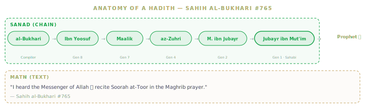
</p>

In the example above, al-Bukhari (d. 256 AH / 870 CE) records a chain of six narrators linking him back to Jubayr ibn Mut'im, a Companion who heard the Prophet directly. The chain passes through Abdullah ibn Yoosuf, then Maalik ibn Anas, then az-Zuhri (Muhammad ibn Shihaab), then Muhammad ibn Jubayr, then his father Jubayr ibn Mut'im. Every link in this chain is a historical person whose character, memory, and chronological plausibility must be verified.

### The Narrator Graph

This is where the modeling challenge begins. The chain structure is not a simple linked list — it is a **dense, directed graph**:

<p align="center">
  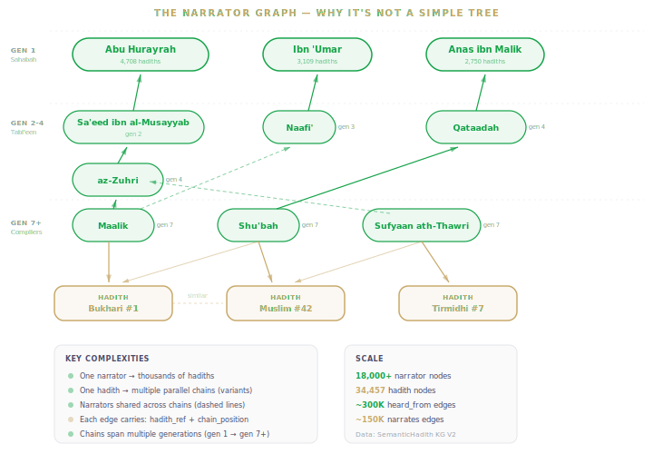
</p>

A single narrator like Abu Hurayrah (may Allah be pleased with him) appears in over 4,700 hadith chains in the dataset. A single hadith can have **multiple parallel chains** — the same report transmitted through different narrators, creating variant chains that must be tracked separately. Narrators are shared across chains: az-Zuhri appears in the isnads of thousands of hadiths, connected to Companions like Abu Hurayrah and Ibn 'Umar through the Tabi'een who heard from them. Every `heard_from` edge carries metadata: which specific hadith this transmission belongs to, and the position in the chain.

At scale: **18,000+ narrator nodes**, **34,457 hadith nodes**, **~300,000 heard_from edges** (student→teacher), and **~150,000 narrates edges** (narrator→hadith). This is not a tree — it is a directed acyclic graph with extensive cross-linking.

### Quran ↔ Hadith Cross-References

The Quran and the Sunnah are not separate silos. Hadiths explain Quranic verses, and Quranic verses provide context for hadiths. This creates a bipartite graph:

<p align="center">
  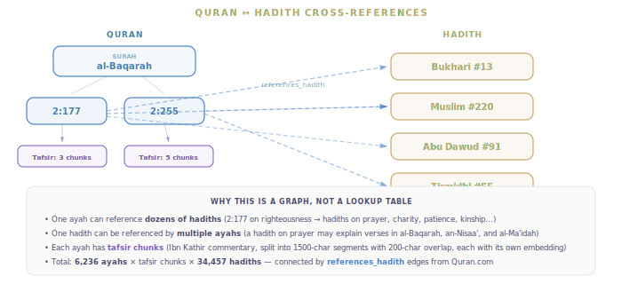
</p>

A single ayah on righteousness (2:177) references dozens of hadiths on prayer, charity, patience, and kinship. A single hadith on prayer may be referenced by verses across multiple surahs. Each ayah also has **Tafsir Ibn Kathir** commentary — often thousands of words — that is chunked into segments (1500 chars, 200-char overlap) for fine-grained semantic retrieval. Each chunk gets its own embedding.

### Arabic Text Challenges

Arabic script introduces normalization problems that can break the entire graph if not handled:

<p align="center">
  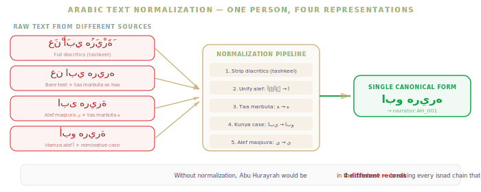
</p>

The same narrator appears with different diacritics, different alef variants (أ vs إ vs آ vs ا — four Unicode code points), taa marbuta vs haa (ة vs ه), and different grammatical cases for kunya patronymics (ابي in genitive vs ابو in nominative). Without normalization, Abu Hurayrah would be four different records in the database — breaking every isnad chain that passes through him.

The normalization pipeline strips diacritics (tashkeel: Unicode 0x064B-0x065F), unifies alef variants, converts taa marbuta to haa, normalizes kunya case, and resolves relative references like "his father" to actual narrator names by extracting them from patronymics.

Arabic morphology also prevents generic stemming for search. The same three-letter root produces dozens of surface forms through vowel patterns, prefixes, and suffixes. A snowball stemmer would incorrectly conflate semantically distinct forms. This is why the project uses separate BM25 analyzers: English gets snowball stemming, Arabic gets tokenization only.

### The Embedding Challenge: Why Co-Location Matters

Every text in the system needs a dense vector embedding for semantic search. But the embeddings must live **alongside the data** — not in a separate vector database:

<p align="center">
  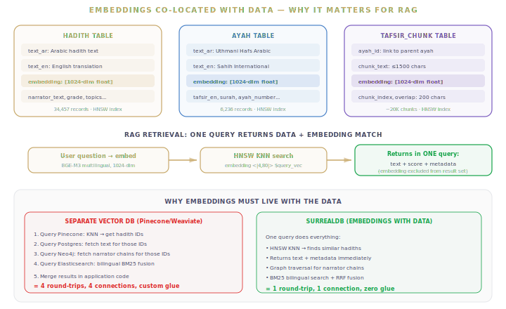
</p>

Three tables carry 1024-dimensional embeddings (via BGE-M3, a multilingual model):

- **hadith** — each of the 34,457 hadiths embeds concatenated Arabic + English text with narrator context
- **ayah** — each of the 6,236 Quran verses embeds Arabic + English text
- **tafsir_chunk** — tafsir commentary is too long for a single embedding, so it's split into ≤1500-char chunks with 200-char overlap; each chunk gets its own embedding

All three have HNSW indexes for sub-millisecond KNN search. When the RAG pipeline retrieves a hadith, it needs the text, the narrator chain (via graph traversal), and the similarity score — all in one query. If embeddings lived in Pinecone while text lived in Postgres and chains lived in Neo4j, every retrieval would require three round-trips across three services. With embeddings co-located in the same database as the data they describe, it is one query, one round-trip.

### How Hadith Chains Are Evaluated

The classical science of *mustalah al-hadith* evaluates chains on multiple dimensions, each of which maps to a database table:

- **Route count** — how many independent chains transmit the same hadith. Mapped to `isnad_analysis.breadth_class`: *mutawatir* (≥10 at every generation), *mashhur* (≥3), *aziz* (≥2), *gharib* (only 1 at some level)
- **Chain continuity** — whether every link in the chain is connected. Mapped to `chain_assessment.continuity`: *muttasil* (connected), *munqati'* (broken), *mursal* (Tabi'i skips Sahabi), *mu'allaq* (missing from beginning), *mu'dal* (2+ consecutive missing)
- **Narrator reliability** — each narrator is assessed by classical scholars on a spectrum from fully trustworthy to fabricator, with detailed citations from biographical dictionaries like Ibn Hajar's *Taqrib al-Tahdhib*. Mapped to the `evidence` table with source references.

<p align="center">
  
</p>

For the complete mustalah al-hadith framework — including all classification types, narrator assessment grades, corroboration rules, and defect detection — see [docs/METHODOLOGY.md](../docs/METHODOLOGY.md).

---

## The Multi-Database Problem

Consider what a database must handle to model this domain:

1. **Deep graph traversal** — narrator chains 10-15+ nodes deep, reachability computation, bottleneck detection, chronology validation (a generation-1 Companion cannot have heard from a generation-3 scholar)
2. **Full-text bilingual search** — BM25 on Arabic text (no stemming) and English text (snowball stemming), fused into a single ranked list
3. **Vector search at scale** — 1024-dim HNSW KNN across 34K+ hadiths, 6K+ ayahs, and ~20K tafsir chunks
4. **Metadata on edges** — `heard_from` edges carry `hadith_ref` and `chain_position`; `narrates` edges carry `chain_position`
5. **Fusion in a single query** — BM25 English + BM25 Arabic + vector KNN fused with Reciprocal Rank Fusion
6. **RAG context assembly** — vector search to find relevant hadiths + graph traversal to fetch narrator chains + text retrieval for tafsir — all in one round-trip to build LLM context

<p align="center">
  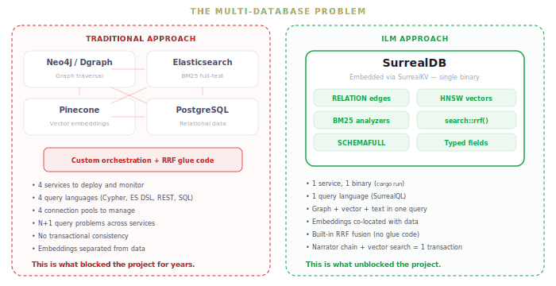
</p>

The traditional approach requires Neo4j for the graph, Elasticsearch for BM25, Pinecone for vectors, and PostgreSQL for relational data — four services, four query languages, and custom orchestration code to join results across them.

I had attempted this project multiple times over the years, each time getting stuck on this orchestration. SurrealDB was the first database where I could model narrator chains as graph edges, index hadith texts for BM25, index embeddings for HNSW vector search, and fuse all three result sets with a single `search::rrf()` call — in one query, one round-trip, one database.

---

## Architecture

<p align="center">
  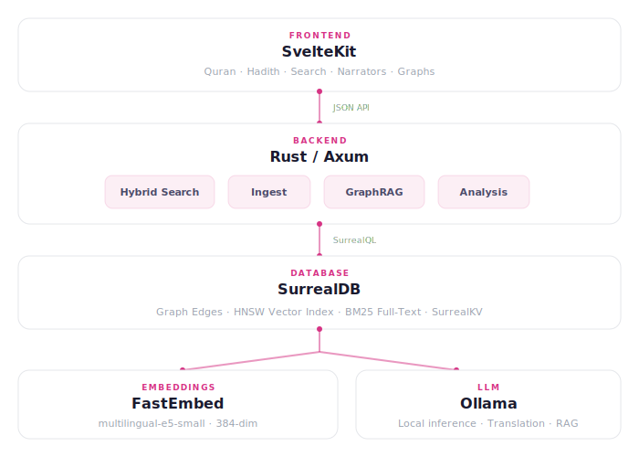
</p>

- **Backend**: Rust with Axum (async HTTP)
- **Frontend**: SvelteKit 2 with Svelte 5 (static SPA served by Axum)
- **Database**: SurrealDB embedded via SurrealKV — no separate server process
- **Embeddings**: FastEmbed with BGE-M3 (1024-dim, multilingual) or Multilingual E5-Small (384-dim)
- **LLM**: Ollama running locally for RAG Q&A

The entire application is a single binary. `cargo run -- serve` starts the database, the API server, and serves the frontend — all in one process.

<p align="center">
  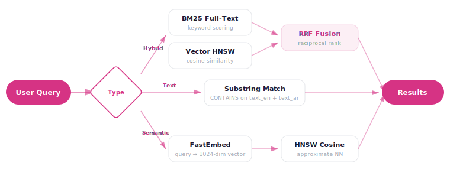
</p>

---

## Schema Deep Dive

Every table, every edge, every index — and how they map to the domain concepts above.

### Core Nodes

```sql
DEFINE TABLE narrator SCHEMAFULL;
DEFINE FIELD name_ar           ON narrator TYPE option<string>;
DEFINE FIELD name_en           ON narrator TYPE string;
DEFINE FIELD generation        ON narrator TYPE option<string>;  -- tabaqah number
DEFINE FIELD kunya             ON narrator TYPE option<string>;  -- patronymic (Abu X)
DEFINE FIELD aliases           ON narrator TYPE option<array<string>>;
DEFINE FIELD reliability_rating ON narrator TYPE option<string>;
DEFINE FIELD ibn_hajar_rank    ON narrator TYPE option<string>;
DEFINE FIELD hadith_count      ON narrator TYPE option<int>;    -- pre-computed via graph
DEFINE INDEX narrator_name ON narrator FIELDS name_en;
```

The `hadith_count` is pre-computed with a single graph aggregation query: `UPDATE narrator SET hadith_count = count(->narrates->hadith)`.

```sql
DEFINE TABLE hadith SCHEMAFULL;
DEFINE FIELD text_ar       ON hadith TYPE option<string>;
DEFINE FIELD text_en       ON hadith TYPE option<string>;
DEFINE FIELD hadith_type   ON hadith TYPE option<string>;  -- marfoo'/mawqoof/qudsee
DEFINE FIELD embedding     ON hadith TYPE option<array<float>>;
DEFINE INDEX hadith_vec ON hadith FIELDS embedding HNSW DIMENSION 1024 DIST COSINE;
```

### Graph Edges: The Core of Isnad

<p align="center">
  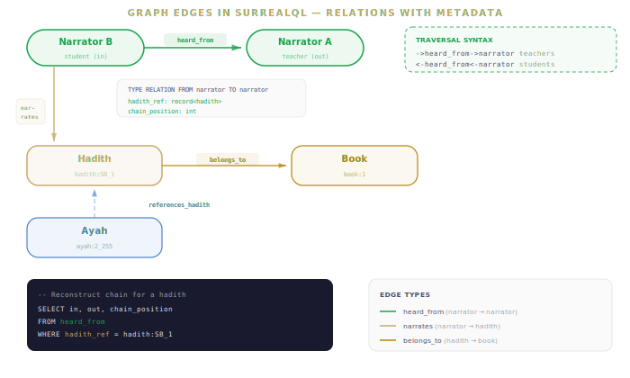
</p>

```sql
-- "Narrator B heard from Narrator A" (student → teacher, toward Prophet)
DEFINE TABLE heard_from TYPE RELATION FROM narrator TO narrator;
DEFINE FIELD hadith_ref    ON heard_from TYPE option<record<hadith>>;
DEFINE FIELD chain_position ON heard_from TYPE option<int>;

-- "Narrator narrates Hadith"
DEFINE TABLE narrates TYPE RELATION FROM narrator TO hadith;
DEFINE FIELD chain_position ON narrates TYPE option<int>;

-- "Hadith belongs to Book"
DEFINE TABLE belongs_to TYPE RELATION FROM hadith TO book;
```

Reconstructing a full chain:

```sql
SELECT in AS student, out AS teacher, chain_position
  FROM heard_from WHERE hadith_ref = hadith:SB_1
  ORDER BY chain_position;
```

Bidirectional narrator traversal:

```sql
-- Teachers
SELECT ->heard_from->narrator.* AS teachers FROM narrator:N_123;
-- Students
SELECT <-heard_from<-narrator.* AS students FROM narrator:N_123;
```

### Quran and Cross-References

```sql
DEFINE TABLE ayah SCHEMAFULL;
DEFINE FIELD text_ar     ON ayah TYPE string;       -- Uthmani Hafs
DEFINE FIELD text_en     ON ayah TYPE option<string>;   -- Sahih International
DEFINE FIELD tafsir_en   ON ayah TYPE option<string>;   -- Ibn Kathir
DEFINE FIELD embedding   ON ayah TYPE option<array<float>>;
DEFINE INDEX ayah_vec ON ayah FIELDS embedding HNSW DIMENSION 1024 DIST COSINE;

DEFINE TABLE references_hadith TYPE RELATION IN ayah OUT hadith;

DEFINE TABLE tafsir_chunk SCHEMAFULL;
DEFINE FIELD ayah_id     ON tafsir_chunk TYPE record<ayah>;
DEFINE FIELD chunk_text  ON tafsir_chunk TYPE string;
DEFINE FIELD embedding   ON tafsir_chunk TYPE option<array<float>>;
DEFINE INDEX tafsir_chunk_vec ON tafsir_chunk FIELDS embedding HNSW DIMENSION 1024 DIST COSINE;
```

### Full-Text Search Indexes

```sql
DEFINE ANALYZER en_analyzer TOKENIZERS blank,class FILTERS lowercase,snowball(english);
DEFINE ANALYZER ar_analyzer TOKENIZERS blank,class;

DEFINE INDEX hadith_text_en ON hadith FIELDS text_en
    FULLTEXT ANALYZER en_analyzer BM25 HIGHLIGHTS;
DEFINE INDEX hadith_text_ar ON hadith FIELDS text_ar
    FULLTEXT ANALYZER ar_analyzer BM25 HIGHLIGHTS;
```

### The Hybrid Search Query

<p align="center">
  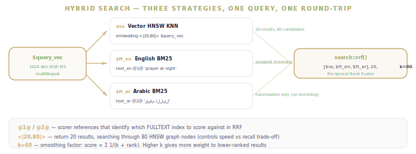
</p>

Three search strategies fused in one query:

```sql
LET $vs = SELECT id, vector::distance::knn() AS distance
    FROM hadith WHERE embedding <|20,80|> $query_vec;

LET $ft_en = SELECT id, search::score(1) AS ft_score
    FROM hadith WHERE text_en @1@ 'prayer at night'
    ORDER BY ft_score DESC LIMIT 20;

LET $ft_ar = SELECT id, search::score(2) AS ft_score
    FROM hadith WHERE text_ar @2@ 'قيام الليل'
    ORDER BY ft_score DESC LIMIT 20;

RETURN search::rrf([$vs, $ft_en, $ft_ar], 20, 60);
```

Vector KNN, English BM25, Arabic BM25 — fused with Reciprocal Rank Fusion (k=60). One query, one round-trip. The `<|20,80|>` syntax means "return 20 results, searching through 80 HNSW graph nodes."

### Scholarly Evidence Model

```sql
DEFINE TABLE evidence SCHEMAFULL;
DEFINE FIELD narrator ON evidence TYPE record<narrator>;
DEFINE FIELD rating   ON evidence TYPE option<string>;
DEFINE FIELD scholar  ON evidence TYPE option<string>;
DEFINE FIELD work     ON evidence TYPE option<string>;
DEFINE FIELD citation_text ON evidence TYPE option<string>;
DEFINE FIELD layer    ON evidence TYPE string;  -- "reported" or "computed"
```

Classical assessments from *Taqrib al-Tahdhib* are stored as "reported" layer evidence with full citations. The tool never overrides classical scholarly judgement.

---

## RAG: Graph-Enhanced Retrieval

The project implements three RAG modes, all running locally via Ollama:

<p align="center">
  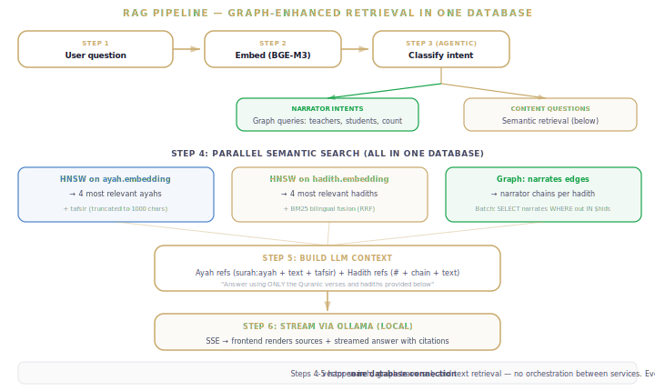
</p>

### Unified RAG (Quran + Hadith)

1. **Embed** the user's question with BGE-M3 (1024-dim, multilingual)
2. **Parallel HNSW search**: 4 most relevant ayahs + 4 most relevant hadiths
3. **Graph traversal**: batch-fetch narrator chains for all retrieved hadiths with a single query: `SELECT out AS hadith, in.name_ar, in.name_en FROM narrates WHERE out IN $hids`
4. **Build context**: ayah references (surah:ayah + text + tafsir truncated to 1000 chars) + hadith references (number + chain + text)
5. **Stream** response from Ollama with system prompt: *"Answer using ONLY the Quranic verses and hadiths provided below. Cite surah and ayah numbers. Cite hadith numbers. Mention the chain of narration when relevant."*
6. **SSE** to frontend: sources first, then streamed answer with citations

### Agentic RAG (Intent Classification)

For narrator-specific questions ("How many hadiths did Abu Hurayrah narrate?", "Who were az-Zuhri's teachers?"), the system first classifies intent via a lightweight LLM call, then runs **structured graph queries** instead of semantic search:

- `narrator_info` → biography + reliability grade
- `narrator_count` → reads pre-computed `hadith_count` (O(1))
- `narrator_teachers` → `SELECT ->heard_from->narrator.*`
- `narrator_students` → `SELECT <-heard_from<-narrator.*`
- `chain_between` → path finding between two narrators
- `content` → falls back to semantic RAG

This means narrator questions are answered with **exact database results**, not LLM guesses. The LLM only formats the response; the data comes directly from the graph.

### Why One Database Matters for RAG

The narrator chain traversal and the vector search happen in the same connection, the same transaction. There is no orchestration layer between "find relevant hadiths" (vector search) and "get the narrator chain for each" (graph traversal). The context sent to the LLM includes both semantic relevance and structural provenance — because both come from the same query.

---

## Isnad Analysis Engine

The mustalah classification is implemented computationally. The engine reports **structural facts** — it does not override classical scholarly grading.

- **Hadith Family Clustering**: Variants of the same hadith grouped by embedding similarity (cosine ≥ 0.85) confirmed by shared narrators. Uses Union-Find for efficient clustering.
- **Chain Continuity Assessment**: Walks each chain checking heard_from edges, generation gaps, and mursal patterns. Classifies as muttasil, munqati', mursal, mu'allaq, or mu'dal.
- **Transmission Breadth**: Groups narrators by tabaqah, counts per level → mutawatir/mashhur/aziz/gharib.
- **Pivot Narrator Detection**: Identifies the *madar al-isnad* — the narrator the family's transmission depends on. Computes bundle coverage, fan-out, and bypass count.
- **Chronology Validation**: Rejects impossible `heard_from` edges where generation gaps ≥ 2 (signals a *tahweel* — compound chain boundary). Splits concatenated chains at these boundaries.
- **Matn Diffing**: Word-level LCS between variant texts, with segments marked as unchanged/added/missing.

---

## Feature Walkthrough

### Quran Reader

<p align="center">
  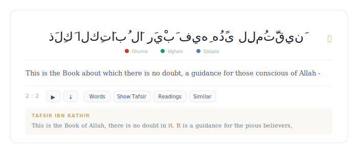
</p>

114 surahs with Tajweed Arabic (QPC Hafs font), Sahih International English, expandable Tafsir Ibn Kathir per ayah. Click any word to see its root, lemma, POS, and grammatical features. Early manuscript images from Corpus Coranicum (Berlin-Brandenburg Academy). Mutashabihat (similar phrases) detection across ayahs.

### Hadith Explorer

<p align="center">
  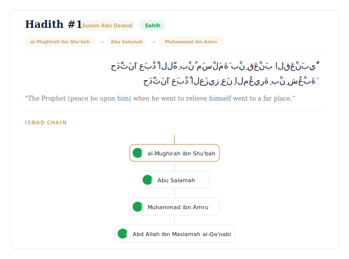
</p>

34,457 hadiths from six collections: Sahih al-Bukhari (7,322), Sahih Muslim (7,454), Sunan an-Nasa'i (5,736), Sunan Abi Dawud (5,244), Sunan Ibn Majah (4,330), Jami at-Tirmidhi (3,925). Each detail page runs a single multi-statement query: hadith text + `<-narrates<-narrator` for the chain + `references_hadith` for linked ayahs + `->similar_to->hadith` for related hadiths.

### Narrator Networks

<p align="center">
  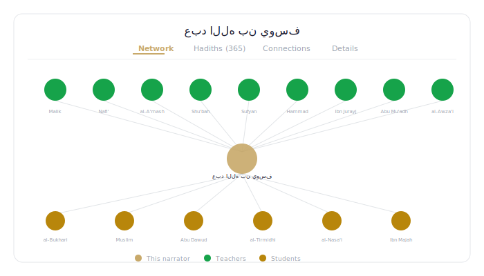
</p>

18,000+ narrators with interactive Sigma.js force-directed graph visualization. Each profile shows teachers, students, hadiths narrated, Ibn Hajar reliability grade, and biographical data. The graph uses tabaqah-based layering.

### Hybrid Search

<p align="center">
  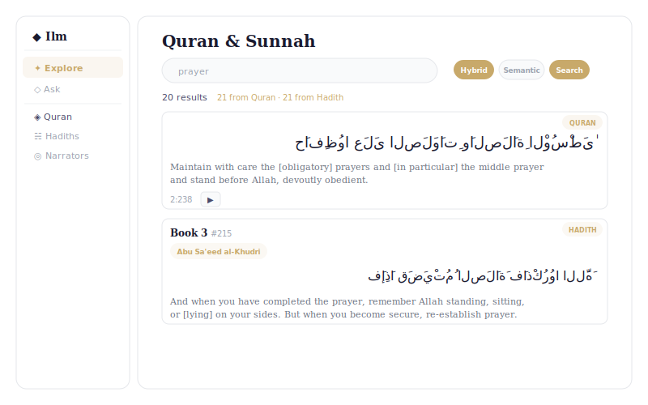
</p>

Three modes: Hybrid (BM25 + vector via RRF), Text (BM25 only), Semantic (vector only). Works in Arabic and English. The Explore page searches Quran and Hadith simultaneously.

### Personal Study Notes

<p align="center">
  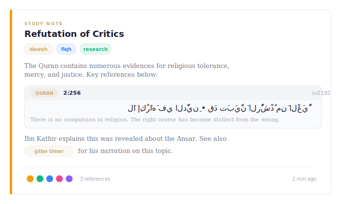
</p>

Rich editor with @mentions: type `@2:255` to embed Ayat al-Kursi inline, or `@bukhari_1` for a hadith. Mentions resolve to rich cards with actual Arabic text + translation. Tags, color-coded highlights, full-text search, JSON export. No user accounts — notes stored by device ID.

---

## Data Pipeline

<p align="center">
  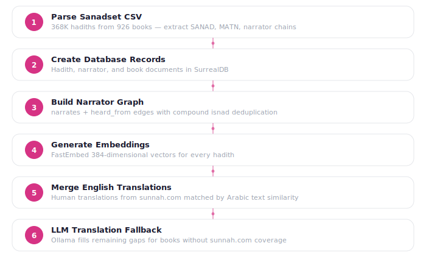
</p>

- **SemanticHadith KG V2** (primary) — 34,457 hadiths with fully identified narrator chains. RDF/Turtle → JSON via Python, enriched with reliability grades via 3-pass Arabic name matching.
- **Sunnah.com translations** — human English translations, merged via normalized Arabic text matching with cascading key lengths (40→30→20→15→10 chars).
- **QUL/Tarteel** — Quran text (QPC Hafs), Sahih International translation, Tafsir Ibn Kathir commentary.
- **Quran.com API** — ayah-to-hadith reference mappings, cached locally.
- **corpus.quran.com** — word-level morphological analysis for 77,000+ tokens.
- **Corpus Coranicum** — early manuscript images from Berlin-Brandenburg Academy (live API).
- **Embedding generation** — FastEmbed with BGE-M3 (1024-dim, multilingual), batch size 64. Applied to all hadiths, ayahs, and tafsir chunks.

---

## Data Sources and Acknowledgments

This project would not exist without the following open-source datasets and academic work:

| Dataset | Source | Records | License |
|---|---|---|---|
| [SemanticHadith KG V2](https://github.com/A-Kamran/SemanticHadith-V2) | A. Kamran et al., *Journal of Web Semantics* 2023 | 34,457 hadiths, 6,786 narrators | Academic open access |
| [Sunnah.com translations](https://huggingface.co/datasets/meeAtif/hadith_datasets) | HuggingFace / sunnah.com | Human English for 6 collections | Various |
| [AR-Sanad](https://github.com/somaia02/Narrator-Disambiguation) | Somaia et al., *Information* 2022 | 18,298 narrators with Ibn Hajar grades | Open |
| [QUL / Tarteel](https://qul.tarteel.ai/) | Tarteel AI | Quran text, translations, tafsir | Open |
| [Corpus Coranicum](https://corpuscoranicum.de/) | Berlin-Brandenburg Academy | Early manuscript images | Academic |
| [corpus.quran.com](https://corpus.quran.com/) | Leeds University | Word morphology for entire Quran | Open |
| [Sanadset 650K](https://data.mendeley.com/datasets/5xth87zwb5/5) | Mendeley Data (PMC 9440281) | 650,986 records from 926 books | CC BY 4.0 |

---

## Training Pipeline: The Vision for a Grounded LLM

<p align="center">
  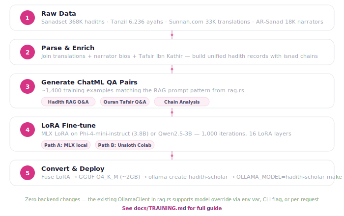
</p>

Currently, Ilm uses **RAG only** — no fine-tuned model. The Ollama LLM generates answers grounded in retrieved sources, but has no domain-specific training.

The project includes a training pipeline for when the corpus is large enough to justify it:

1. **Generate training data** — a Python script reads the ingested database and produces ChatML Q&A pairs matching the exact RAG prompt pattern
2. **Fine-tune** — LoRA fine-tuning via [Unsloth](https://github.com/unslothai/unsloth) on Google Colab
3. **Export** — convert to GGUF for Ollama deployment (`ollama create hadith-scholar -f Modelfile`)
4. **Deploy** — zero backend changes; the Rust `OllamaClient` already supports model override

The vision: as more hadith books and tafsir sources are added, generate higher-quality training data grounded in the actual texts. Additional hadith collections (Musnad Ahmad, Muwatta' Malik, Sahih Ibn Khuzaymah), additional tafsir (at-Tabari, al-Qurtubi, as-Sa'di) — each addition enriches both the RAG context and the potential training corpus. This requires time, compute resources, and scholarly review. Contributions are welcome.

---

## Contributing

Ilm is open source. The [repository](https://github.com/arriqaaq/ilm) contains everything needed to build, ingest, and run the platform from scratch.

Currently covering the six canonical collections. The expansion path includes:

- **More hadith collections** — Musnad Ahmad, Muwatta' Malik, Sahih Ibn Khuzaymah, Sahih Ibn Hibbaan, Sunan al-Bayhaqi, Musannaf 'Abdur-Razzaaq
- **Arabic NLP** — better tokenization, morphological analysis for hadith texts
- **Narrator disambiguation** — Arabic naming conventions (kunya, laqab, nisba) create difficult deduplication problems
- **Additional tafsir** — at-Tabari, al-Qurtubi, as-Sa'di alongside Ibn Kathir
- **Scholarly review** — verification of the mustalah analysis against classical references
- **UI/UX** — accessibility, mobile, reading modes

This tool is for study and research, grounded in classical *mustalah al-hadith* methodology. It reports structural facts about hadith chains and narrator assessments from classical biographical dictionaries — it does not issue rulings. For *fatwas* and their application, one must approach the scholars of knowledge directly.

The scholars of hadith preserved this knowledge with great care and rigor — travelling across lands, spending their lives memorizing, verifying, and documenting. Imam al-Bukhari said: "I have memorized one hundred thousand *sahih* hadiths, and two hundred thousand hadiths which are not *sahih*." Imam Muslim said: "I did not include here everything which I consider *sahih*. I only included what the scholars have agreed upon."

The least we can do is make their work searchable.

والحمد لله رب العالمين
