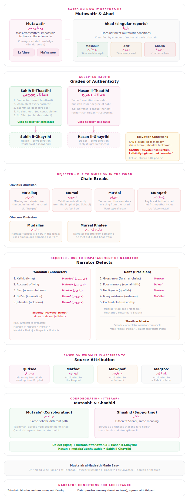

# Hadith Transmission Analysis: Methodology & Algorithms

## 1. Introduction

This document describes the computational methodology used for analyzing hadith transmission chains (isnad) in this project. The system implements the classical science of *mustalah al-hadith* (hadith terminology) — the traditional Islamic framework for evaluating the authenticity of Prophetic reports — using graph-theoretic analysis of isnad topology.

The methodology follows established principles from:

- **Dr. 'Imaad 'Alee Jum'ah**, *Mustalah al-Hadeeth Made Easy* (primary reference)
- **Mahmood at-Tahhaan**, *Tayseer Mustalah al-Hadeeth*
- **As-Suyootee**, *Tadreeb ar-Raawee fee Sharh Taqreeb an-Nawaawee*

The reliability layer draws on traditional *'ilm al-rijal* (narrator criticism) classifications from works like Ibn Hajar al-Asqalani's *Taqrib al-Tahdhib*, which predates orientalist hadith criticism by centuries and represents a far more rigorous and comprehensive system of source evaluation.

For a detailed scholarly critique of the orientalist approach to hadith (Goldziher, Schacht, Juynboll), see [Appendix A](#appendix-a-critique-of-orientalist-hadith-methodology).

## 2. Terminologies

| Term | Arabic | Definition |
|------|--------|------------|
| **Sanad** | سند | The chain of individuals connected to the matn (text) |
| **Matn** | متن | The text at which the sanad ends |
| **Hadeeth** | حديث | Any statement, action, approval, or description ascribed to the Prophet |
| **Khabar** | خبر | Report — synonymous with or more general than hadeeth |
| **Athar** | أثر | Remnant — statements/actions ascribed to Sahaabah and Taabi'een |
| **Isnaad** | إسناد | Attributing a statement to the one who made it; same as sanad |
| **Musnad** | مسند | A marfoo' hadeeth with a muttasil (connected) sanad |
| **Muhaddith** | محدث | One who works extensively in hadeeth, well-acquainted with narrations and their narrators |
| **Haafith** | حافظ | Higher degree — what he knows at every tabaqah is more than what he doesn't know |
| **Tabaqah** | طبقة | A group of people similar in age and level of isnaad |

## 3. Classification of Hadith

<p align="center">
  
</p>

### 3.1 Based on How it Reached Us

#### Mutawatir (متواتر)

**Definition**: What has been narrated by such a large number that it is inconceivable that they collaborated to propagate a lie.

**Ruling**: Conveys *'ilm darooree* (certain knowledge) — one is obliged to decisively accept it.

**Conditions**:
1. A large number of people narrate it (minimum: 10, per the chosen opinion)
2. This large number is present at **all levels** of the chain
3. It is inconceivable that they could have collaborated to propagate a lie
4. The report is based upon sense perception ("we heard" or "we saw")

**Categories**:
- **Lafthee**: mutawatir in both wording and meaning
- **Ma'nawee**: mutawatir in meaning, but not wording

#### Ahad (آحاد)

**Definition**: A narration that does not fulfill the conditions of being mutawatir.

**Ruling**: Conveys *'ilm natharee* (knowledge that must be investigated) — acceptance is conditional upon examination.

**Categories by number of routes**:

| Category | Arabic | Definition | Threshold |
|----------|--------|------------|-----------|
| **Mashhur** | مشهور | Narrated by 3+ at each tabaqah, below mutawatir | >= 3 per level |
| **'Aziz** | عزيز | No less than 2 narrators at every level of the sanad | >= 2 at every level |
| **Gharib** | غريب | Reported by one narrator only | = 1 at some level |

**Gharib** has two sub-types:
- **Gharib Mutlaq** (Fard Mutlaq): only one narrator at the root of the sanad (e.g., hadith of intentions narrated only by 'Umar)
- **Gharib Nisbee** (Fard Nisbee): only one narrator at a later point in the sanad

**Note**: Mashhur can be saheeh, hasan, da'eef, or even mawdoo' — the classification is about route count, not quality.

### 3.2 Based on Acceptance and Rejection

#### Accepted Hadith

##### Saheeh li-Thaatihi (صحيح لذاته)

Has a sanad connected from beginning to end, by way of narrators each of whom is *'adl* (upright) and *daabit* (retentive), without having any *shuthooth* or *'illah*.

**Five conditions**:
1. **Connected sanad** (ittisal): every narrator reported directly from the one prior
2. **'Adaalah**: every narrator is Muslim, *baaligh*, *'aaqil*, not a *faasiq*, and not *makhroom al-muroo'ah*
3. **Dabt**: every narrator is *taamm ad-dabt* (completely retentive) — either *dabt as-sadr* (by heart) or *dabt al-kitaab* (by writing)
4. **Absence of shuthooth**: no contradiction by a thiqah against someone more reliable
5. **Absence of 'illah**: no hidden, obscure defect that impairs authenticity

**Ruling**: Used as proof by consensus of the scholars of hadeeth, usool, and fiqh.

##### Hasan li-Thaatihi (حسن لذاته)

Same conditions as saheeh, but the narrator has a **lesser degree of dabt** (e.g., *saduq* rather than *thiqah*).

**Ruling**: Used as proof, just as the saheeh, despite not being as strong.

##### Saheeh li-Ghayrihi (صحيح لغيره)

The hasan li-thaatihi narration when it is reported through another similar route or one even stronger. Its being saheeh does not result from its own sanad — rather, it only results from combining others with it.

**Rank**: Above hasan li-thaatihi, below saheeh li-thaatihi.

##### Hasan li-Ghayrihi (حسن لغيره)

The da'eef narration when it has numerous routes, and the reason for it being da'eef is **not fisq (open sinfulness) of a narrator, or kathib (lying)**.

The da'eef ascends to hasan li-ghayrihi due to two factors:
1. It is reported through one or more other routes **similar or greater in strength**
2. The reason for being da'eef is either **poor memory**, **a break in the sanad**, or **jahaalah** (not knowing a narrator)

**Rank**: Lower than hasan li-thaatihi. Among the accepted narrations used as proof.

#### Rejected Hadith — Due to Omission in the Isnad

| Type | Arabic | Definition | Form |
|------|--------|------------|------|
| **Mu'allaq** | معلق | One or more consecutive narrators omitted from the **beginning** of the isnad | Hanging |
| **Mursal** | مرسل | Omission of anyone after the Taabi'ee at the **end** of the isnad | A Tabi'i says "The Prophet said..." |
| **Mu'dal** | معضل | Two or more **consecutive** narrators omitted from the isnad | Worst type of break |
| **Munqati'** | منقطع | Any break in the isnad not fitting the above types | One missing in middle |
| **Mudallas** | مدلس | Narrator conceals a flaw in the isnad using ambiguous phrasing | Obscure omission |
| **Mursal Khafee** | مرسل خفي | Narrator reports from someone he met but didn't hear from | Obscure omission |

**Severity ranking** (worst to mildest): Mu'dal > Munqati' > Mudallas > Mursal

#### Rejected Hadith — Due to Disparagement of the Narrator

**Disparagement of 'Adaalah (character)**:

| Cause | Arabic | Result |
|-------|--------|--------|
| 1. Kathib (lying) | كذب | **Mawdoo'** (fabricated) — the worst type |
| 2. Accused of lying | تهمة بالكذب | **Matrook** (abandoned) |
| 3. Fisq (open sinfulness) | فسق | **Munkar** (disapproved) |
| 4. Bid'ah (innovation) | بدعة | **Da'eef** (weak) |
| 5. Jahaalah (unknown) | جهالة | **Da'eef** (weak) |

**Disparagement of Dabt (precision)**:

| Cause | Arabic | Result |
|-------|--------|--------|
| 1. Gross error (fuhsh al-ghalat) | فحش الغلط | **Munkar** |
| 2. Poor memory (soo' al-hifth) | سوء الحفظ | **Da'eef** |
| 3. Negligence (ghaflah) | غفلة | **Munkar** |
| 4. Many mistakes (kathrah al-awhaam) | كثرة الأوهام | **Mu'allal** (defective) |
| 5. Contradicting trustworthy narrators | مخالفة الثقات | **Mudraj** / **Maqloob** / **Mudtarib** / **Musahhaf** / **Shaath** |

**Severity ranking** (weakest to strongest, per Ibn Hajar):
Mawdoo' > Matrook > Munkar > Mu'allal > Mudraj > Maqloob > Mudtarib

**Key distinction**: *Shaath* = what an **acceptable** narrator reports in contradiction to someone more reliable. *Munkar* = what a **da'eef** narrator reports in contradiction to a thiqah.

### 3.3 Based on Whom it is Ascribed to

| Type | Arabic | Ascribed to | Notes |
|------|--------|-------------|-------|
| **Qudsee** | قدسي | Allah (meaning) via the Prophet (wording) | Not Qur'an; ~200+ narrations |
| **Marfoo'** | مرفوع | The Prophet | Statement, action, approval, or description |
| **Mawqoof** | موقوف | A Sahaabi | Statement, action, or approval |
| **Maqtoo'** | مقطوع | A Tabi'i or later | Cannot be used as proof for legal rulings |

### 3.4 Corroboration: Mutaabi' and Shaahid

**I'tibaar** (اعتبار): The process of scrutinizing the routes of a hadeeth narrated by a single narrator, to find if anyone else narrated it as well.

**Mutaabi'** (متابع): A hadeeth that agrees (in wording or meaning) with a *fard* hadeeth, narrated from the **same Sahaabee**.
- **Mutaaba'ah Taammah**: agreement from the beginning of the isnaad
- **Mutaaba'ah Qaasirah**: agreement from a later point

**Shaahid** (شاهد): A hadeeth that agrees (in wording or meaning) with a *fard* hadeeth, narrated from a **different Sahaabee**.

## 4. Narrator Assessment

### 4.1 Conditions for Acceptance

**'Adaalah** (uprightness): Muslim, baaligh (mature), 'aaqil (of sound mind), not a faasiq, and not compromising overall integrity.

**Dabt** (precision): Does not contradict the thiqaat, not having poor memory, not committing gross error, not known for negligence, and not making many mistakes. Determined by: the narrator agrees with the thiqaat most of the time.

### 4.2 Grades of Ta'deel and Jarh

**Six grades of ta'deel** (validation, from highest to lowest):

| Grade | Example phrases | Ruling |
|-------|----------------|--------|
| 1. Superlative | *athbat an-naas*, *awthaq* | Used as proof |
| 2. Emphasized | *thiqatun thabt*, *thiqatun ma'moon* | Used as proof |
| 3. Simple reliability | *thiqah*, *hujjah*, *'adlun daabit* | Used as proof |
| 4. Without dabt sense | *sadooq*, *laa ba'sa bihi* | Not used as proof; collected and examined |
| 5. Neutral | *shaykh*, *wasat* | Not used as proof; collected and examined |
| 6. Near disparagement | *saalih al-hadeeth*, *yu'tabaru bihi* | Written for i'tibaar only |

**Six grades of jarh** (disparagement, from mildest to severest):

| Grade | Example phrases | Ruling |
|-------|----------------|--------|
| 1. Carelessness | *layyin al-hadeeth*, *feehi maqaal* | Written for i'tibaar only |
| 2. Cannot be proof | *da'eef*, *lahu manaakeer* | Written for i'tibaar only |
| 3. Not to be written | *da'eef jiddan*, *tarahoo hadeethahu* | Not written, not for i'tibaar |
| 4. Accused of lying | *muttahamun bil-kathib*, *saaqit* | Not written, not for i'tibaar |
| 5. Known liar | *kaththaab*, *waddaa'* | Not written, not for i'tibaar |
| 6. Superlative lying | *akthab an-naas* | Not written, not for i'tibaar |

**Rules**: Ta'deel is accepted without explanation; jarh is not accepted unless explained. If both exist for one narrator, jarh is given precedence as long as it is explained.

## 5. Computational Implementation

This section describes how the classical principles above are implemented computationally in this tool.

### 5.1 Hadith Families

Hadith variants sharing the same original report are grouped into **families** using:
- **Embedding similarity**: cosine similarity >= 0.85 between 1024-dim bge-m3 vectors
- **Narrator overlap**: shared narrators between chains confirm the grouping
- **Union-Find clustering**: groups of 2+ hadiths meeting both criteria

### 5.2 Per-Chain Isnad Assessment

For each individual transmission chain (variant) in a family:

**Chain Continuity**: Walk the isnad from collector to source, checking:
1. Does a `heard_from` edge exist between consecutive narrators?
2. Are there generation gaps > 1 between consecutive narrators?
3. Is the root narrator a Tabi'i with no teacher (mursal)?

Classify as: Muttasil, Munqati', Mursal, Mu'allaq, or Mu'dal.

**Weakest-Link Analysis**: The chain grade cannot exceed what the weakest narrator allows. Find the narrator with the lowest `reliability_prior` and grade accordingly:
- All narrators >= 0.75 (thiqah) + muttasil + no defects = **Saheeh**
- All narrators >= 0.65 (saduq) + muttasil + no defects = **Hasan**
- Below saduq, or not muttasil, or unknown narrators = **Da'eef**
- Matruk/accused narrator present (< 0.35) = **Da'eef Jiddan**
- Known fabricator = **Mawdoo'**

### 5.3 Transmission Breadth Classification

Group narrators by tabaqah (generation layer), count distinct narrators per level:

| Classification | Threshold |
|---------------|-----------|
| Mutawatir | >= 10 at every tabaqah (computational proxy) |
| Mashhur | >= 3 at each tabaqah |
| 'Aziz | >= 2 at every level |
| Gharib | = 1 at some level |

For gharib, the **bottleneck tabaqah** and the **fard narrator** (single narrator at that level) are recorded.

### 5.4 Corroboration Detection (I'tibaar)

- **Group chains by Sahabi**: the root narrator (topmost in each chain, generation = 1) identifies the Sahabi
- **Mutaba'at**: within each Sahabi group, count divergent paths (> 1 variant = has mutaba'at)
- **Shawahid**: count distinct Sahabah in the family (> 1 = has shawahid)
- **Reliability check**: are corroborating chains through narrators with reliability >= 0.65 (saduq or better)?

**Corroboration strength levels**:
- **Strong**: 3+ reliable mutaba'at, or multiple shawahid
- **Moderate**: 1-2 mutaba'at, or shawahid present
- **Weak**: only da'eef corroborating chains
- **None**: single chain (fard)

### 5.5 Composite Grading

Following the textbook definitions exactly:

| Best Chain | Corroboration | Composite Grade |
|-----------|--------------|----------------|
| Saheeh | Any | Saheeh |
| Hasan | Strong/Moderate | **Saheeh li-Ghayrihi** |
| Hasan | Weak/None | Hasan |
| Da'eef (light weakness) | Strong/Moderate | **Hasan li-Ghayrihi** |
| Da'eef (severe: fisq/kathib) | Any | Da'eef (never elevated) |
| Da'eef Jiddan | Any | Da'eef Jiddan (never elevated) |
| Mawdoo' | Any | Mawdoo' (never elevated) |

**Elevation eligibility**: Only da'eef due to light weakness (poor memory, chain break, jahaalah) can be elevated. Munkar, Matrook, and Mawdoo' are **never** elevated regardless of corroboration.

### 5.6 Defect Detection

Computational flags for potential defects:

- **Chronology conflicts**: student's generation predates teacher's generation
- **Potential idtirab**: multiple equal-strength chains with irreconcilable textual differences
- **Matn coherence**: word-level LCS-based diffing between variants; low similarity (< 0.5) flags potential textual issues
- **Majhul narrators**: chains containing unknown narrators are flagged

**Note**: True *'ilal* detection requires specialist knowledge. The tool flags *potential* issues; final determination requires a qualified muhaddith.

### 5.7 Pivot Narrators (Madar al-Isnad)

Structural pivot points are identified — narrators upon whom the family's transmission depends:

- **Bundle coverage**: fraction of variants containing this narrator
- **Fan-out**: number of direct students
- **Collector diversity**: distinct terminal narrators reachable downstream
- **Bypass count**: variants that transmit the hadith without this narrator (mutaba'at)
- **Bottleneck**: narrator with coverage >= 0.95 (the family depends almost entirely on them)

This is the recognized concept of *madar al-isnad* — the pivot the chain revolves around. It carries no negative connotation; it is purely structural.

## 6. Reliability Layer

### 6.1 Evidence Model

- **Reported**: Classical scholar assessments from biographical dictionaries (e.g., Tahdhib al-Kamal, Taqrib al-Tahdhib, Mizan al-I'tidal). Full weight.
- **Analytical**: Derived from structural analysis. Half weight.
- **Derived**: Weighted composite of reported + analytical layers.

### 6.2 Rating Priors

| Rating | Arabic | Prior | Description |
|--------|--------|-------|-------------|
| thiqah | ثقة | 0.75 | Trustworthy |
| saduq | صدوق | 0.65 | Truthful |
| majhul | مجهول | 0.50 | Unknown |
| daif | ضعيف | 0.35 | Weak |
| matruk | متروك | 0.20 | Abandoned |
| accused_fabrication | متهم بالوضع | 0.20 | Accused of fabrication |

Sahaabah (generation 1) are rated thiqah by scholarly consensus (*ijma'*), regardless of individual grading.

### 6.3 Derived Assessment Algorithm
```
For each evidence record:
  prior = rating_prior(rating)
  weight = rating_confidence (default 0.5)

  If reported layer: weighted_sum += prior * weight
  If analytical layer: weighted_sum += prior * weight * 0.5  // half-weighted

derived_confidence = weighted_sum / total_weight

// Contradiction pairs: thiqah+daif, thiqah+matruk, thiqah+accused, matruk+accused
If contradiction detected: derived_confidence = min(derived_confidence, 0.70)
```

## 7. Anti-Hallucination Safeguards

### 7.1 Synthetic Pattern Detection
Evidence IDs matching these patterns are rejected:
- Prefixes: `synthetic_*`, `placeholder_*`, `fake_*`, `test_*`, `dummy_*`, `generated_*`, `auto_*`
- Exact matches: `null`, `undefined`, `n/a`, `none`, `unknown`
- Content containing: `fake`, `fabricat`, `forged`

### 7.2 Evidence Validation
- All narrator IDs in chains must exist in the database
- Source references must include: collection, source_type, source_locator
- Verified source types: `url`, `print`, `manuscript`

### 7.3 RAG Output Validation
- Narrator names in LLM responses verified against database
- Hadith numbers referenced checked against provided context
- Warnings injected for unverifiable claims

## 8. Matn Diffing

Word-level Longest Common Subsequence (LCS) between hadith text variants:
- Tokenize by whitespace
- Standard DP algorithm O(n*m) with 120,000 cell safety guard
- Output segments: unchanged, added, missing
- Similarity ratio = 2 * lcs_length / (words_a + words_b)

## 9. Worked Example

Consider a hadith family with 8 variants transmitted through 3 Sahabah:

**Chain assessments**:
- 4 chains: muttasil, all narrators thiqah -> **Sahih**
- 2 chains: muttasil, weakest narrator is saduq (0.65) -> **Hasan**
- 1 chain: muttasil, narrator with poor memory (0.45) -> **Da'eef** (light weakness)
- 1 chain: munqati' (generation gap) -> **Da'eef** (light weakness)

**Transmission breadth**:
- Tabaqah 1 (Sahabi): 3 narrators -> not gharib at this level
- Tabaqah 2 (Tabi'i): 5 narrators
- Tabaqah 3: 7 narrators
- Minimum breadth = 3 -> **Mashhur**

**Corroboration**:
- 3 distinct Sahabah -> 2 shawahid
- Within Sahabi A's group: 4 variants, 3 mutaba'at (2 reliable) -> **Strong**

**Composite grade**:
- Best chain = Sahih -> family grade = **Sahih**
- (Even the da'eef chains would be elevated to Hasan li-Ghayrihi due to strong corroboration)

## References

### Mustalah al-Hadith sources

- Jum'ah, 'Imaad 'Alee. *Mustalah al-Hadeeth Made Easy* (Silsilah al-'Uloom al-Islaamiyyah al-Muyassarah). The Message of Islam.
- at-Tahhaan, Mahmood. *Tayseer Mustalah al-Hadeeth*.
- as-Suyootee, Jalaal ad-Deen. *Tadreeb ar-Raawee fee Sharh Taqreeb an-Nawaawee*.
- Ibn Hajar al-Asqalani (d. 852 AH). *Nukhbah al-Fikar fee Mustalah Ahl al-Athar*.

### Primary critiques (recommended reading)

- Barmaver, S.N. (2025). *Dismantling Orientalist Narratives: A Critique of Orientalists' Approach to Hadith with special focus on Juynboll*. Arriqaaq Publications. **Free digital version**: https://www.academia.edu/143038577/Dismantling_Orientalist_Narratives_A_Critique_of_Orientalists_Approach_to_Hadith_with_special_focus_on_Juynboll
- Azami, M.M. (1985). *On Schacht's Origins of Muhammadan Jurisprudence*. King Saud University.
- Motzki, H. (2010). *Analysing Muslim Traditions: Studies in Legal, Exegetical and Maghazi Hadith*. Brill.
- Motzki, H. (2002). *The Origins of Islamic Jurisprudence: Meccan Fiqh Before the Classical Schools*. Brill.

### Classical Islamic sources

- Ibn Hajar al-Asqalani (d. 852 AH). *Taqrib al-Tahdhib*. The primary source for narrator reliability classifications used in this tool.
- al-Mizzi (d. 742 AH). *Tahdhib al-Kamal fi Asma' al-Rijal*. Comprehensive biographical dictionary of Six Book narrators.
- al-Dhahabi (d. 748 AH). *Mizan al-I'tidal fi Naqd al-Rijal*. Biographical dictionary focused on criticized narrators.
- Ibn Sa'd (d. 230 AH). *al-Tabaqat al-Kubra*. Earliest major biographical collection of Companions and Successors.

### Orientalist works (referenced for critique in Appendix A)

- Goldziher, I. (1890). *Muhammedanische Studien*. 2 vols. Halle.
- Juynboll, G.H.A. (1983). *Muslim Tradition*. Cambridge University Press.
- Juynboll, G.H.A. (2007). *Encyclopedia of Canonical Hadith*. Brill.
- Schacht, J. (1950). *The Origins of Muhammadan Jurisprudence*. Clarendon Press.
- Crone, P. and Cook, M. (1977). *Hagarism*. Cambridge University Press.

---

## Appendix A: Critique of Orientalist Hadith Methodology

This appendix presents the scholarly critique of the orientalist approach to hadith, drawing primarily on Barmaver's *Dismantling Orientalist Narratives* (2025), Azami's *On Schacht's Origins of Muhammadan Jurisprudence* (1985), and Motzki's analytical work (2002, 2010). It documents the specific methodological flaws in the orientalist tradition (Goldziher, Schacht, Juynboll) and the mustalah al-hadith tradition's detailed responses to their claims.

### 1.1 Critical Scholarly Context: The Orientalist Approach to Hadith and Its Refutation

The Common Link theory rests on foundations laid by Joseph Schacht (1950) and refined by G.H.A. Juynboll (1983, 2007). Both scholars' work is built on fundamentally flawed methodology that has been decisively refuted by scholars from both the Islamic tradition and Western academia. This section provides a comprehensive treatment of these flaws, drawing primarily on Barmaver's *Dismantling Orientalist Narratives* (2025), Azami's *On Schacht's Origins of Muhammadan Jurisprudence* (1985), and Motzki's analytical work (2002, 2010).

#### 1.1.1 The Orientalist Tradition's Approach to Hadith

The Western academic study of hadith has followed a trajectory of increasing skepticism:

- **Ignaz Goldziher (1890)** in *Muhammedanische Studien* initiated systematic doubt about hadith authenticity, arguing that most traditions reflected later communal debates projected backward onto the Prophet. Goldziher's approach was based on flawed assumptions about the nature of hadith transmission and lacked the methodological rigor to support the sweeping conclusions he drew. As Barmaver (2025) demonstrates, his foundational premises -- particularly his presumption that hadith reflected communal debates rather than authentic Prophetic teaching -- were asserted rather than proven.

- **Joseph Schacht (1950)** in *The Origins of Muhammadan Jurisprudence* attempted to formalize Goldziher's skepticism into a methodology. He introduced the concept of "back-projection" -- the theory that legal hadiths were fabricated to support already-established legal positions and then attributed to earlier authorities. Schacht's core methodological tool was the argument from silence (*argumentum e silentio*): if a tradition was not cited when it would have been useful, it must not have existed yet.

- **G.H.A. Juynboll (1983, 2007)** refined Schacht's approach into the Common Link theory, arguing that the narrator at the convergence point of a transmission network was the likely fabricator. His *Encyclopedia of Canonical Hadith* (2007) represents the fullest application of this theory, covering approximately 600 hadiths from the major collections.

- **Patricia Crone and Michael Cook (1977)** in *Hagarism* pushed skepticism to its extreme, questioning the reliability of the entire Islamic historical tradition. Both later disowned their central thesis (see Section 1.1.4).

The foundational assumption shared by this tradition is that **all Prophetic reports are presumed fabricated until proven otherwise**. This inverts the Islamic scholarly tradition's epistemological default, which holds that reports transmitted through verified chains are presumed authentic unless evidence of weakness is identified (*al-asl fi al-riwaya al-qabul*). The Islamic approach developed a sophisticated science of narrator criticism (*'ilm al-jarh wa al-ta'dil*) specifically to identify and exclude weak or fabricated transmissions -- a system that predates orientalist hadith criticism by approximately eight centuries and operates with far greater methodological rigor (see Section 1.1.6).

#### 1.1.2 Joseph Schacht's Methodology -- Detailed Critique

Joseph Schacht's *The Origins of Muhammadan Jurisprudence* (1950) established the modern orientalist approach to hadith skepticism. His methodology contains fundamental errors documented by Azami (1985), Motzki (2002, 2010), and Barmaver (2025):

**1. The argument from silence (*argumentum e silentio*)**

Schacht considered this "the best way" to determine fabrication: if a tradition was not cited in a legal debate where it would have been relevant, it must not have existed yet. Azami (1985) demonstrated that this rests on four demonstrably false assumptions:

(a) That all early scholarly works survive in print. In reality, only a fraction of early Islamic legal and hadith literature is extant. Entire libraries were destroyed in political upheavals, and many works survive only through later citations or manuscript fragments.

(b) That a scholar's silence about a tradition proves the tradition did not exist. A scholar may not have cited a relevant hadith for numerous reasons: it was not part of their particular transmission network, they considered it unnecessary because the point was already established, they were addressing a different aspect of the issue, or the work in question was not a comprehensive treatment.

(c) That one scholar's knowledge must be universal among contemporaries. Hadith transmission was geographically distributed across the Islamic world -- from Medina and Kufa to Basra, Damascus, and beyond. A scholar in one city would not necessarily have access to every tradition circulating in another.

(d) That scholars used all available evidence when discussing any topic. Legal works (*fiqh*) and hadith collections serve different purposes. A jurist might establish a ruling through one hadith while being aware of others; a compiler might select from multiple variants based on chain strength.

Barmaver (2025) provides specific examples of traditions that Schacht declared late fabrications but which appear in earlier sources Schacht did not access, demonstrating that the "silence" was in Schacht's source base, not in the historical record.

**2. Overgeneralization from a narrow source base**

Schacht's conclusions were drawn primarily from Medinan legal texts and the works of al-Shafi'i. He lacked access to critical early sources, including:

- The *Musannaf* of Abd al-Razzaq al-San'ani (d. 211/826), one of the earliest surviving hadith compilations organized by legal topic
- The *Musannaf* of Ibn Abi Shaybah (d. 235/849), another major early compilation
- Numerous other early collections that preserve earlier transmission networks

Motzki (2002) demonstrated that when these broader sources are examined, traditions Schacht dated to the late first/early second Islamic century are found with earlier, more extensive transmission networks. The narrow source base created a systematically distorted picture: Schacht was observing the limitations of his own evidence, not the limitations of the historical tradition.

Barmaver (2025) documents specifically which sources Schacht lacked and traces how their inclusion fundamentally changes the chronological conclusions Schacht drew. In multiple cases, the Musannafs of Abd al-Razzaq and Ibn Abi Shaybah contain traditions with chains that predate the "origin points" Schacht assigned.

**3. Misquotation and selective reading**

Azami documented multiple instances where Schacht misquoted or misrepresented source materials to support his thesis. The most striking example: Schacht cited Malik as quoting al-Zuhri's decision as "this is the sunna," implying that the practice was attributed to al-Zuhri rather than the Prophet. Azami showed that Malik's very next line -- which Schacht omitted -- ascribed the practice directly to the Prophet Muhammad. The truncation reversed the meaning of the source.

Barmaver (2025) identifies additional cases where Schacht's citations are incomplete or misleading, including instances where he translated Arabic terms in ways that favored his thesis over more natural readings.

**4. The "shorter is older" assumption**

Schacht promoted the theory that shorter hadith texts are older and longer versions represent later fabricated expansions designed to add detail and specificity. This became a methodological axiom in orientalist hadith studies.

Motzki (2010) presented multiple counter-examples showing that longer texts can be earlier than shorter ones. Abbreviation was a common practice among hadith transmitters: a narrator might transmit the full text to some students and a shortened version to others, depending on context. The assumption that textual growth always indicates fabrication ignores the documented practices of hadith transmission, where both expansion (through additional context) and contraction (through selection of the most relevant portion) were normal.

**5. Circular logic**

Schacht's argument structure is self-referential: he assumes traditions are forged, then uses the absence of these (allegedly forged) traditions from certain sources as proof of forgery. This is a textbook example of begging the question (*petitio principii*). Barmaver (2025) traces how this circularity pervades Schacht's methodology: the conclusion (fabrication) is embedded in the premises, making the argument unfalsifiable within its own framework.

**6. The "back-projection" theory**

Schacht's central thesis holds that legal hadiths were created after legal positions were already established in the schools of law. Under this theory, jurists first developed legal opinions through reasoning (*ra'y*), and only later fabricated Prophetic traditions to lend authority to positions they had already adopted.

Azami and Barmaver demonstrate that this chronology is frequently inverted: in multiple documented cases, the hadith demonstrably precedes the legal debate. The Musannafs preserve traditions with early chains that were circulating before the legal positions they allegedly were fabricated to support even existed. Furthermore, the theory requires that jurists who were simultaneously developing the science of hadith criticism -- specifically designed to detect fabrication -- were themselves fabricating hadiths. This internal contradiction undermines the theory's coherence.

**7. Ignoring the isnad system's internal checks**

Schacht treats isnads as arbitrary constructions that can be fabricated at will. This ignores the elaborate system of verification that the Islamic tradition developed precisely to detect and prevent fabrication:

- **Contemporary cross-checking**: Hadith scholars routinely compared chains from different students of the same teacher to verify accuracy. Discrepancies triggered investigation.
- **Travel for verification (*al-rihla fi talab al-hadith*)**: Scholars traveled extensively across the Islamic world specifically to verify transmissions by hearing them from multiple independent sources.
- **Biographical scrutiny (*'ilm al-rijal*)**: Every narrator in a chain was evaluated for character, memory, accuracy, and possible bias. Scholars compiled massive biographical dictionaries documenting these evaluations.
- **Defect analysis (*'ilm al-'ilal*)**: A specialized discipline devoted to identifying subtle defects in apparently sound transmissions -- hidden disconnections, narrator confusion, or textual mixing.

Dismissing this entire system as ineffective or complicit in fabrication requires extraordinary evidence that neither Schacht nor his successors have provided.

#### 1.1.3 G.H.A. Juynboll's Methodology -- Detailed Critique

G.H.A. Juynboll built on Schacht's foundation to develop the Common Link theory in *Muslim Tradition* (1983) and its most complete application in *Encyclopedia of Canonical Hadith* (2007). His methodology has been critiqued by scholars including Motzki (2010) and most comprehensively by Barmaver (2025). The specific errors include:

**1. The foundational assumption of universal fabrication**

As Barmaver (2025) demonstrates, Juynboll's operating assumption is that all reports attributed to the Prophet are presumed forged until proven otherwise. This is not a conclusion drawn from evidence but a methodological axiom -- a starting assumption that shapes every subsequent analysis and inverts the Islamic scholarly tradition's epistemological default.

The implausibility of this assumption becomes apparent at scale: it requires believing that thousands of scholars across multiple continents (from Spain to Central Asia) and eight centuries orchestrated and concealed a massive forgery enterprise. These same scholars simultaneously developed the world's most rigorous source-criticism methodology (*'ilm al-hadith*) -- a discipline whose explicit purpose was to detect and expose exactly the kind of fabrication Juynboll assumes was universal. The theory requires that the architects of the most sophisticated anti-fabrication system in pre-modern history were themselves the fabricators. This violates Occam's Razor: the simpler explanation -- that the system largely worked as intended -- requires far fewer auxiliary assumptions.

**2. Narrow source base**

Juynboll relies principally on al-Mizzi's *Tuhfat al-Ashraf*, a reference work that indexes narrators and traditions found in the Six Books (Sahih al-Bukhari, Sahih Muslim, Sunan Abu Dawud, Sunan al-Tirmidhi, Sunan al-Nasa'i, and Sunan Ibn Majah) and a few minor collections. As Barmaver (2025) documents, this reliance on a single index as the basis for sweeping conclusions about an entire transmission tradition is methodologically indefensible.

This narrow base systematically distorts the analysis:

- Transmission networks appear to converge later than they actually do, because earlier links preserved in non-Six-Book sources are invisible to the analysis
- Common Links appear in later generations (Successors and Followers of Successors) rather than in the Companion era where broader evidence places them
- Corroborating chains that exist in earlier collections like the Musannafs are missed entirely

When Motzki examined broader sources -- including the Musannaf of Abd al-Razzaq, al-Bayhaqi's *Dala'il al-nubuwwa*, and other early compilations -- he found that "the real 'Common Links' appear in the time of the Companions in the second half of the seventh century," far earlier than Juynboll identified. This finding alone undermines the core chronological argument: if the CLs are Companions (the Prophet's direct associates), the fabrication thesis loses its chronological foundation.

**3. Dismissal of all corroborating transmissions**

This is the core mechanism by which Juynboll's theory achieves unfalsifiability. He employs two classifications to dismiss any evidence that contradicts the fabrication thesis:

- **"Plagiarism of the Common Link's isnad"**: When multiple chains converge at the same narrator, Juynboll treats all but one as copies of the CL's chain. Corroborating transmissions (*mutaba'at*) -- the very evidence that classical hadith scholars use to verify authenticity -- are dismissed wholesale as fabricated copies.

- **"Diving isnads"**: When chains bypass the CL and connect directly to earlier narrators through independent paths, Juynboll classifies these as later fabrications designed to give the appearance of independent shorter links. The term "diving" suggests the chain "dives" past the CL to create a false appearance of earlier transmission.

Together, these classifications create an unfalsifiable framework: evidence supporting the CL-as-fabricator thesis is taken at face value, while evidence contradicting it is reclassified as additional fabrication. Barmaver (2025) analyzes this in terms of Karl Popper's demarcation criterion: a theory that cannot in principle be falsified by any observable evidence is not scientific. Juynboll's framework fails this test -- there is no conceivable evidence pattern that his theory cannot absorb as confirming fabrication.

This approach also dismisses the entire classical concept of corroborating transmission that Muslim hadith scholars developed over centuries. The science of *mutaba'at* and *shawahid* (corroborating and supporting narrations) represents a sophisticated methodology for evaluating the reliability of transmissions through independent verification. Treating all corroboration as "plagiarism" requires dismissing this entire discipline without providing an alternative means of distinguishing genuine from fabricated chains.

**4. The "age-trick" (*mu'ammarun*) theory**

Juynboll claimed that narrators with unusually long lifespans were fictional characters, invented and inserted into chains to bridge chronological gaps that would otherwise make a chain impossible. He coined the term *mu'ammarun* ("long-lived ones") for these allegedly fictional narrators.

Barmaver (2025) refutes this claim with detailed biographical evidence from primary sources. Using the *Tarikh* of Ibn Asakir (one of the most comprehensive biographical dictionaries of Damascus), the *Tabaqat* of Ibn Sa'd (the earliest major biographical collection), and other classical sources, Barmaver demonstrates that the narrators Juynboll dismissed as fictional have substantial, independently corroborated biographical records. Their lifespans, while long, fall within documented ranges for the era and region. Multiple independent sources confirm their existence, their teachers, their students, and their geographical movements -- the kind of detailed, cross-referenced evidence that is extremely difficult to fabricate consistently across multiple independent biographical traditions compiled in different cities by different scholars.

**5. Inconsistent methodology**

Motzki (2010) observed that Juynboll "did not follow one method in the study of isnads" and "selects the dates in the literature he finds the most favourable to his argument while ignoring others." This inconsistency is not merely a weakness in application -- it reveals a fundamental problem with the methodology itself: when the "method" can be flexibly applied to reach a predetermined conclusion, it is not functioning as a method but as a rhetorical device.

Barmaver (2025) documents specific cases where Juynboll applies different criteria to different hadiths based on the outcome he wishes to reach. In some cases, he treats early attestation as evidence of authenticity; in others, he treats it as evidence of early fabrication. The criteria shift based on the desired conclusion rather than being applied consistently.

**6. The "spider" and "diving" strand classifications**

Juynboll developed a taxonomy of isnad patterns that functions as a classification system for dismissing counter-evidence:

- **Spider strands**: Transmission paths that bypass the CL and connect to earlier narrators. Under authentic transmission, these would represent independent corroborating chains. Juynboll classifies them as fabricated "diving isnads."
- **Single strands**: Linear chains with no corroboration above the CL. Under authentic transmission, these might simply reflect selective preservation. Juynboll treats them as evidence that the CL fabricated a chain backward to the Prophet.
- **Bundles**: Multiple students transmitting from the same teacher. This is the CL pattern itself, which Juynboll treats as evidence of fabrication origin.

The result is that every conceivable isnad pattern -- whether convergent, divergent, corroborated, or uncorroborated -- is interpreted as evidence of fabrication. A classification system that confirms the same conclusion regardless of input is not performing analysis; it is performing confirmation bias.

**7. Juynboll's treatment of the Companions**

Juynboll's chronological framework places the origins of most hadiths in the late first or early second Islamic century -- the era of the Successors (*tabi'un*) and Followers of Successors (*tabi' al-tabi'in*). This implicitly dismisses Companion-era transmission: if the CL is the fabricator and CLs are identified in these later generations, then the Companions' role as original transmitters is denied.

This conflicts with substantial historical evidence. The Companions of the Prophet are the best-documented generation in early Islamic history. Their movements, residences, teaching activities, and inter-personal relationships are recorded in multiple independent biographical traditions. Many Companions are documented by non-Islamic sources as well. The hypothesis that their role as transmitters of Prophetic teachings was largely fictional requires dismissing an enormous body of biographical evidence from diverse, independent sources.

Furthermore, Motzki's broader source analysis places the actual convergence points in the Companion era -- precisely where the Islamic tradition locates the origin of hadith transmission. The apparent shift to later generations is an artifact of Juynboll's narrow source base, not a feature of the historical record.

**8. The unfalsifiability problem**

Barmaver (2025) demonstrates that Juynboll's framework is structured so that virtually any evidence can be reinterpreted to confirm fabrication. This is the most fundamental methodological critique: a theory that predicts every possible outcome is not making a genuine prediction.

In Popperian terms, a scientific theory must specify in advance what observations would refute it. Juynboll's theory fails this test:

- If a hadith has a single transmission chain: evidence of fabrication (the fabricator didn't bother creating corroborating chains)
- If a hadith has multiple corroborating chains: evidence of fabrication (the corroborating chains are "plagiarisms" or "diving isnads")
- If the CL is in an early generation: early fabrication
- If the CL is in a later generation: later fabrication
- If narrators bypass the CL: the bypass is itself fabricated
- If no narrators bypass the CL: the fabricator controlled all transmission

No conceivable pattern of evidence could, within this framework, demonstrate authentic transmission. This is not a property of the historical evidence -- it is a property of the framework itself. A methodology that cannot be wrong cannot, by definition, be right in any meaningful epistemic sense.

As Barmaver (2025) establishes through comprehensive scholarly analysis, the orientalist approach to hadith does not survive rigorous scrutiny. The structural predictions implied by Juynboll's thesis consistently fail against empirical transmission data.

#### 1.1.4 Retractions Within the Orientalist Tradition

The trajectory of orientalist hadith skepticism includes significant retractions that are rarely acknowledged in the literature:

- **Patricia Crone and Michael Cook** published *Hagarism: The Making of the Islamic World* (1977), which represented the most extreme form of orientalist skepticism -- questioning the reliability of the entire Islamic historical tradition and proposing a radical reconstruction of early Islamic history based almost entirely on non-Islamic sources. Both authors later disowned their central thesis:
  - Cook stated: "The central thesis...was, I now think, mistaken."
  - Crone acknowledged it was "merely a hypothesis, not a conclusive finding."

- These retractions are significant because *Hagarism* represented the logical endpoint of the skeptical trajectory: if one applies Schacht's and Juynboll's methods consistently and without restraint, one arrives at conclusions so extreme that even their own authors cannot sustain them. The fact that the most radical application of orientalist hadith skepticism was retracted by its own authors raises fundamental questions about the methodology that produced it.

- Despite these retractions, subsequent scholars have continued to build on the same foundational assumptions without adequately addressing why the most consistent application of those assumptions led to conclusions that had to be abandoned.

#### 1.1.5 Motzki's Reinterpretation and Its Limitations

Harald Motzki's work is significant because he critiqued the CL theory from within Western academia, using the same analytical tools but applying them more rigorously and to a broader source base. His key findings:

- The Common Link was **not a fabricator** but rather "the first systematic collector of ahadith and a professional teacher of knowledge, particularly about people living in the first century of Islam." The CL pattern reflects teaching activity, not fabrication: a scholar who taught hadith to many students would naturally appear as a convergence point in the transmission network.

- The single-strand phenomenon in early hadith collections reflects collectors providing only one transmission source because they considered these traditions highly reliable and well-established -- not because the traditions were fabricated. A compiler who records one chain for a hadith is exercising editorial selection, not revealing a fabrication.

- When drawing on broader sources beyond the Six Books -- particularly the Musannaf of Abd al-Razzaq al-San'ani -- the real convergence points appear in the Companion era, in the second half of the seventh century. This finding confirms rather than undermines the traditional Islamic account of early hadith transmission.

- Motzki developed the **isnad-cum-matn** method, which examines the correlation between transmission paths and textual variations. If different chains correspond to genuine variation in the transmitted text (different wordings, additional or omitted details), this is strong evidence of independent transmission from multiple sources -- not fabrication from a single source, which would produce uniform text.

Motzki's significance lies in the fact that even a Western academic working within the orientalist tradition's own analytical framework found Juynboll's fabrication thesis to be wrong. However, as Barmaver (2025) notes, "despite his contributions, Motzki lacked expertise in the specialized fields of *Ilm al-Hadith*, *al-Jarh wa al-Ta'dil*, and *Ilm al-Ilal*" -- the traditional Islamic hadith sciences that provide the most rigorous framework for evaluating transmissions. Barmaver goes substantially further than Motzki, dismantling the orientalist approach at its foundations using the full apparatus of the Islamic hadith sciences -- a system that has been evaluating transmissions with far greater rigor and broader evidence for centuries. If even Motzki could see that Juynboll was wrong, the continued adherence to the fabrication thesis in some Western academic circles is a matter of institutional inertia, not evidence.

#### 1.1.6 The Islamic Tradition's Framework

The Islamic tradition developed a comprehensive science of hadith evaluation (*'ilm al-hadith* or *mustalah al-hadith*) that includes multiple independent sub-disciplines:

**'Ilm al-rijal (Narrator Criticism)**

The science of evaluating individual narrators predates orientalist hadith criticism by approximately eight centuries. Its key features include:

- **Systematic biographical documentation**: Scholars compiled massive biographical dictionaries covering tens of thousands of narrators. Major works include al-Mizzi's *Tahdhib al-Kamal* (covering narrators of the Six Books), al-Dhahabi's *Mizan al-I'tidal* (focusing on criticized narrators), and Ibn Hajar al-Asqalani's *Taqrib al-Tahdhib* (a condensed assessment of all Six Book narrators).

- **Multi-source evaluation**: Each narrator was evaluated by multiple independent scholars across different cities and generations. A narrator rated *thiqah* (trustworthy) by scholars in Medina, Kufa, and Baghdad has been independently vetted by three distinct scholarly communities.

- **Specific criteria**: Narrators were evaluated on memory (*dabt*), moral character (*'adala*), accuracy of transmission, and potential biases. These criteria were applied consistently across the network.

**Al-Jarh wa al-Ta'dil (Criticism and Validation)**

The specialized discipline of pronouncing narrators reliable or unreliable, with documented rules for when criticism takes precedence over validation and vice versa. This system produced the six-tier reliability scale used in this tool:

| Rating | Arabic | Description | Prior |
|--------|--------|-------------|-------|
| thiqah | ثقة | Trustworthy -- strong memory, upright character, accurate transmission | 0.75 |
| saduq | صدوق | Truthful -- generally reliable but may have minor lapses | 0.65 |
| majhul | مجهول | Unknown -- insufficient information to evaluate | 0.50 |
| daif | ضعيف | Weak -- identified problems with memory, accuracy, or character | 0.35 |
| matruk | متروك | Abandoned -- severe weakness, scholars ceased transmitting from them | 0.20 |
| accused_fabrication | متهم بالوضع | Accused of fabrication -- evidence of deliberate invention | 0.20 |

These ratings were derived from cross-checking contemporaneous evidence: a narrator's students, peers, and later critics each contributed independent assessments. The convergence of multiple independent evaluations provides a form of scholarly "triangulation" that is resistant to individual bias.

**'Ilm al-'Ilal (Defect Analysis)**

The most specialized and demanding sub-discipline: identifying subtle defects (*'ilal*) in apparently sound transmissions. These include:

- Hidden chain disconnections where a narrator claims to have heard from someone they never met
- Narrator confusion where two different people with similar names are conflated
- Textual mixing where the content of one hadith is accidentally combined with the chain of another
- Unauthorized additions where a narrator inserts explanatory commentary that becomes conflated with the transmitted text

Only scholars with encyclopedic knowledge of narrator biographies, transmission patterns, and textual variants were considered qualified to practice this discipline. Figures like Ali ibn al-Madini (d. 234 AH), al-Bukhari (d. 256 AH), and al-Daraqutni (d. 385 AH) are recognized as masters of this field.

**Why this system is not circular**

A potential objection is that the Islamic tradition's evaluation of hadith is circular: scholars validated transmissions using criteria developed by the same tradition. This objection misunderstands the system's structure:

1. Narrator evaluations are based on **peer testimony** -- contemporaries who observed the narrator's memory, character, and accuracy. This is external evidence about an individual, not self-referential assessment.

2. Multiple **independent evaluators** in different cities assessed the same narrators. Convergent assessments from scholars who had no contact with each other constitute independent evidence.

3. **Cross-chain verification**: The same hadith transmitted through different chains provides a natural control. If multiple independent chains from different cities and different students produce the same text, this corroborates both the text and the reliability of the narrators in those chains.

4. The system **explicitly identifies and flags fabrication**. The categories *matruk* and *accused_fabrication* demonstrate that the tradition detected and excluded unreliable narrators. If the entire system were complicit in fabrication, there would be no incentive to develop and maintain these critical categories.

#### 1.1.7 Scholarly Conclusion

As Barmaver (2025) concludes through comprehensive scholarly analysis, the orientalist approach to hadith is built on flawed premises, circular reasoning, and unfalsifiable assumptions:

- The Common Link pattern reflects authentic teaching and transmission activity, not fabrication
- Corroborating transmissions (*mutaba'at* and *shawahid*) are genuine independent evidence, not "plagiarisms"
- The argument from silence is a methodological error, not a valid analytical tool
- The orientalist assumption of default fabrication is demonstrably wrong, not merely "methodologically unsound"
- The classical *'ilm al-rijal* tradition provides a rigorous, independent evidentiary framework that predates orientalist hadith criticism by approximately eight centuries

The full scholarly case is made in Barmaver's *Dismantling Orientalist Narratives* (2025, free on [Academia.edu](https://www.academia.edu/143038577/Dismantling_Orientalist_Narratives_A_Critique_of_Orientalists_Approach_to_Hadith_with_special_focus_on_Juynboll)).
